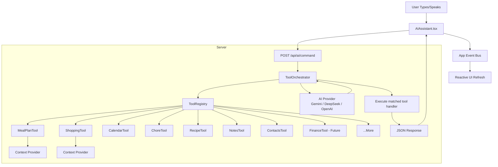

# AI Tool Registry Architecture Plan

## 1. Current State Analysis

### What exists now
The AI assistant lives at [`src/app/api/ai/command/route.ts`](src/app/api/ai/command/route.ts) (~1328 lines) and is a **monolithic god file** containing:

- **Function declarations** (lines 10-258): A hardcoded `FunctionDeclaration[]` array defining 17 AI tools for meal plans, notes, shopping, todos, calendar, chores, recipes, contacts, birthdays, and documents.
- **Context loading** (lines 518-563): 6 parallel Prisma queries fetching recipes, shopping lists, todo lists, meal plans, chores, and events — all loaded upfront regardless of what the user actually asks.
- **System prompt construction** (lines 611-640): A monolithic template string embedding all that context.
- **Function dispatch** (lines 650-1326): A massive `if/else if` chain with 20+ branches, each handling a specific function call with inline database operations.

On the frontend, [`src/components/ai/AIAssistant.tsx`](src/components/ai/AIAssistant.tsx) has a hardcoded `switch` statement (lines 133-156) mapping action names to app events for UI refresh.

### Key Pain Points

| Pain Point | Impact |
|---|---|
| **Monolithic file** | Every new capability requires editing the same 1300+ line file |
| **No plugin architecture** | Features can't self-register their AI capabilities |
| **Forced function calling** | `FunctionCallingMode.ANY` / `tool_choice: required` prevents natural conversation |
| **Eager context loading** | Every query runs every time, wasting tokens and DB resources |
| **Hardcoded action mapping** | Frontend needs updating for every new tool |
| **No lazy tool discovery** | All tools are defined upfront; can't add domain-specific tools later |
| **Tight coupling** | AI logic mixed with business logic in every handler |

---

## 2. Proposed Architecture: Tool Registry Pattern

The core idea is a **decentralized tool registration system** where each feature module owns its AI tool definitions, context providers, and execution handlers. The central AI route becomes a thin orchestrator.

### High-level Architecture



### Component Breakdown

#### 2.1 Tool Registry (src/lib/ai/tool-registry.ts)

A singleton registry that maintains a map of tool names to tool definitions:

```typescript
interface AiTool {
  // Tool definition sent to the LLM (name, description, parameters schema)
  definition: FunctionDeclaration | ToolDefinition
  
  // Optional: provides context that should be injected into the system prompt
  contextProvider?: (familyId: string, userId: string) => Promise<string>
  
  // Executes the tool when the LLM calls it
  handler: (args: Record<string, unknown>, context: HandlerContext) => Promise<HandlerResult>
  
  // Optional: maps action names to app events for UI refresh
  actionEvents?: Record<string, AppEventName>
}

const tools = new Map<string, AiTool>()

export function registerTool(name: string, tool: AiTool): void { ... }
export function getAllDefinitions(): FunctionDeclaration[] { ... }
export function getContextProviders(): ContextProvider[] { ... }
export function executeTool(name: string, args, context): Promise<HandlerResult> { ... }
```

#### 2.2 Tool Modules

Each feature area defines its own tool(s) in a self-contained module:

- [`src/lib/ai/tools/meal-plan.tool.ts`](src/lib/ai/tools/meal-plan.tool.ts) — 4 tools: `setMealPlan`, `queryMealPlan`, `queryMealSuggestions`, `toggleMealPlanRecipe`
- [`src/lib/ai/tools/shopping.tool.ts`](src/lib/ai/tools/shopping.tool.ts) — 5 tools: `addShoppingListItem`, `queryShoppingList`, `completeListItem`, `categorizeShoppingItems`, `combineDuplicateItems`
- [`src/lib/ai/tools/todo.tool.ts`](src/lib/ai/tools/todo.tool.ts) — 1 tool: `addTodoItem`
- [`src/lib/ai/tools/calendar.tool.ts`](src/lib/ai/tools/calendar.tool.ts) — 2 tools: `createEvent`, `queryEvents`
- [`src/lib/ai/tools/chores.tool.ts`](src/lib/ai/tools/chores.tool.ts) — 2 tools: `completeChore`, `queryChores`
- [`src/lib/ai/tools/recipes.tool.ts`](src/lib/ai/tools/recipes.tool.ts) — 2 tools: `searchRecipes`, `getRecipeDetails`
- [`src/lib/ai/tools/notes.tool.ts`](src/lib/ai/tools/notes.tool.ts) — 2 tools: `queryNotes`, `createNote`
- [`src/lib/ai/tools/contacts.tool.ts`](src/lib/ai/tools/contacts.tool.ts) — 1 tool: `searchContacts`
- [`src/lib/ai/tools/documents.tool.ts`](src/lib/ai/tools/documents.tool.ts) — 1 tool: `searchDocuments`
- [`src/lib/ai/tools/birthdays.tool.ts`](src/lib/ai/tools/birthdays.tool.ts) — 1 tool: `queryUpcomingBirthdays`
- [`src/lib/ai/tools/finance-bills.tool.ts`](src/lib/ai/tools/finance-bills.tool.ts) — 3 tools: `queryBills`, `markBillPaid`, `queryBillDetails`
- [`src/lib/ai/tools/finance-accounts.tool.ts`](src/lib/ai/tools/finance-accounts.tool.ts) — 3 tools: `queryBalances`, `querySpendingByCategory`, `queryMonthlySummary`
- [`src/lib/ai/tools/calendar-summary.tool.ts`](src/lib/ai/tools/calendar-summary.tool.ts) — 1 tool: `queryWeekSummary` (aggregates events, chores, meals, bills, birthdays)
- [`src/lib/ai/tools/finance-goals.tool.ts`](src/lib/ai/tools/finance-goals.tool.ts) — 2 tools: `queryBudgetStatus`, `querySavingsGoals`
- [`src/lib/ai/tools/meal-plan-suggest.tool.ts`](src/lib/ai/tools/meal-plan-suggest.tool.ts) — 1 tool: `suggestMeals` (recency & mood-based scoring)
- [`src/lib/ai/tools/finance-income.tool.ts`](src/lib/ai/tools/finance-income.tool.ts) — 2 tools: `queryIncome`, `markIncomeReceived`
- [`src/lib/ai/tools/family.tool.ts`](src/lib/ai/tools/family.tool.ts) — 2 tools: `queryFamilyMembers`, `queryFamilyOverview`
- [`src/lib/ai/tools/finance-tax.tool.ts`](src/lib/ai/tools/finance-tax.tool.ts) — 2 tools: `queryTaxSummary`, `queryDeductibleExpenses`
- [`src/lib/ai/tools/memory.tool.ts`](src/lib/ai/tools/memory.tool.ts) — 1 tool: `queryMealHistory`
- [`src/lib/ai/tools/reports.tool.ts`](src/lib/ai/tools/reports.tool.ts) — 1 tool: `generateFinanceReport`
- [`src/lib/ai/tools/reminders.tool.ts`](src/lib/ai/tools/reminders.tool.ts) — 2 tools: `queryUpcomingReminders`, `setReminder`
- [`src/lib/ai/tools/finance-nl-transaction.tool.ts`](src/lib/ai/tools/finance-nl-transaction.tool.ts) — 1 tool: `quickAddTransaction`
- [`src/lib/ai/tools/digest.tool.ts`](src/lib/ai/tools/digest.tool.ts) — 1 tool: `generateDailyDigest`

Each tool module exports a `register()` function that calls `registerTool()`:

```typescript
// src/lib/ai/tools/meal-plan.tool.ts (conceptual)
export function registerMealPlanTools(): void {
  registerTool('addRecipeToMealPlan', {
    definition: { name: 'addRecipeToMealPlan', description: '...', parameters: {...} },
    contextProvider: async (familyId) => {
      const recipes = await prisma.recipe.findMany(...)
      return `Available recipes: ...`
    },
    handler: async (args, { user, prisma }) => {
      // extracted handler logic
    },
    actionEvents: {
      addRecipeToMealPlan: AppEvents.MEAL_PLAN_UPDATED,
      clearMealPlanSlot: AppEvents.MEAL_PLAN_UPDATED,
    }
  })
}
```

#### 2.3 Streamlined Central Route

The central [`src/app/api/ai/command/route.ts`](src/app/api/ai/command/route.ts) becomes dramatically simpler:

1. Import and call all register*() functions
2. Collect all tool definitions from registry
3. Collect all context providers from registry
4. Build system prompt by running context providers
5. Send to LLM with all tool definitions
6. Execute the matched handler from registry
7. Return result with action metadata

#### 2.4 Lazy Context Loading

Each tool provides a `contextProvider` that returns a string of context. The orchestrator can implement **smart context selection** based on the user's prompt (e.g., if the user says "what's for dinner?", only load meal plan context).

#### 2.5 Frontend Event Dispatching

The frontend switch statement gets replaced with a registry-driven approach:

```typescript
const actionEventMap = new Map<string, AppEventName>()
// Populated from all registered tools' actionEvents
// Then: const event = actionEventMap.get(data.action); if (event) dispatchAppEvent(event)
```

---

## 3. Migration Strategy

The refactor can be done incrementally without breaking existing functionality.

### Phase 1: Core Infrastructure
1. Create [`src/lib/ai/types.ts`](src/lib/ai/types.ts) — shared types
2. Create [`src/lib/ai/tool-registry.ts`](src/lib/ai/tool-registry.ts) — the registry singleton
3. Create [`src/lib/ai/provider.ts`](src/lib/ai/provider.ts) — extract provider calling logic (Gemini + OpenAI) from route.ts
4. Create [`src/lib/ai/context-builder.ts`](src/lib/ai/context-builder.ts) — context collection logic
5. Create [`src/lib/ai/orchestrator.ts`](src/lib/ai/orchestrator.ts) — the orchestrator that ties it all together

### Phase 2: Extract Tools (one by one)
Extract each functional area from the monolithic route into its own tool file:

6. [`src/lib/ai/tools/meal-plan.tool.ts`](src/lib/ai/tools/meal-plan.tool.ts)
7. [`src/lib/ai/tools/shopping.tool.ts`](src/lib/ai/tools/shopping.tool.ts)
8. [`src/lib/ai/tools/todo.tool.ts`](src/lib/ai/tools/todo.tool.ts)
9. [`src/lib/ai/tools/calendar.tool.ts`](src/lib/ai/tools/calendar.tool.ts)
10. [`src/lib/ai/tools/chores.tool.ts`](src/lib/ai/tools/chores.tool.ts)
11. [`src/lib/ai/tools/recipes.tool.ts`](src/lib/ai/tools/recipes.tool.ts)
12. [`src/lib/ai/tools/notes.tool.ts`](src/lib/ai/tools/notes.tool.ts)
13. [`src/lib/ai/tools/contacts.tool.ts`](src/lib/ai/tools/contacts.tool.ts)
14. [`src/lib/ai/tools/documents.tool.ts`](src/lib/ai/tools/documents.tool.ts)
15. [`src/lib/ai/tools/birthdays.tool.ts`](src/lib/ai/tools/birthdays.tool.ts)
16. [`src/lib/ai/tools/index.ts`](src/lib/ai/tools/index.ts) — barrel file that registers all tools

### Phase 3: Refactor Route
17. Rewrite [`src/app/api/ai/command/route.ts`](src/app/api/ai/command/route.ts) to use the orchestrator
18. Remove the 1300-line file's hardcoded logic

### Phase 4: Frontend Updates
19. Update [`src/components/ai/AIAssistant.tsx`](src/components/ai/AIAssistant.tsx) to use registry-driven event mapping
20. Update [`src/components/settings/AISettingsTab.tsx`](src/components/settings/AISettingsTab.tsx) to reflect new capabilities dynamically

### Phase 5: New Tools and Polish (Completed)
21. ✅ Natural language transaction entry via [`quickAddTransaction`](src/lib/ai/tools/finance-nl-transaction.tool.ts)
22. ✅ All 14 suggested AI tool modules implemented — see module listing above
23. 🔲 Smart context selection (only provide context for relevant tools) — still pending optimization

---

## 4. Current File Structure

```
src/
  lib/
    ai/
      types.ts                    # Shared types (AiTool, HandlerContext, HandlerResult, etc.)
      tool-registry.ts            # Singleton registry (registerTool, executeTool, getActionEventMap)
      provider.ts                 # LLM provider adapter (Gemini + OpenAI-compatible)
      context-builder.ts          # Context aggregation (buildSystemPrompt)
      orchestrator.ts             # Main orchestration logic (orchestrate)
      tools/
        index.ts                  # Barrel: registers all 24 tools across 14 modules
        meal-plan.tool.ts         # 4 tools: setMealPlan, queryMealPlan, queryMealSuggestions, toggleMealPlanRecipe
        shopping.tool.ts          # 5 tools: addShoppingListItem, queryShoppingList, completeListItem,
                                  #          categorizeShoppingItems, combineDuplicateItems
        todo.tool.ts              # 1 tool: addTodoItem
        calendar.tool.ts          # 2 tools: createEvent, queryEvents
        chores.tool.ts            # 2 tools: completeChore, queryChores
        recipes.tool.ts           # 2 tools: searchRecipes, getRecipeDetails
        notes.tool.ts             # 2 tools: queryNotes, createNote
        contacts.tool.ts          # 1 tool: searchContacts
        documents.tool.ts         # 1 tool: searchDocuments
        birthdays.tool.ts         # 1 tool: queryUpcomingBirthdays
        finance-bills.tool.ts     # 3 tools: queryBills, markBillPaid, queryBillDetails
        finance-accounts.tool.ts  # 3 tools: queryBalances, querySpendingByCategory, queryMonthlySummary
        calendar-summary.tool.ts  # 1 tool: queryWeekSummary (aggregates events/chores/meals/bills/birthdays)
        finance-goals.tool.ts     # 2 tools: queryBudgetStatus, querySavingsGoals
        meal-plan-suggest.tool.ts # 1 tool: suggestMeals (recency & mood-based scoring)
        finance-income.tool.ts    # 2 tools: queryIncome, markIncomeReceived
        family.tool.ts            # 2 tools: queryFamilyMembers, queryFamilyOverview
        finance-tax.tool.ts       # 2 tools: queryTaxSummary, queryDeductibleExpenses
        memory.tool.ts            # 1 tool: queryMealHistory
        reports.tool.ts           # 1 tool: generateFinanceReport
        reminders.tool.ts         # 2 tools: queryUpcomingReminders, setReminder
        finance-nl-transaction.tool.ts  # 1 tool: quickAddTransaction
        digest.tool.ts            # 1 tool: generateDailyDigest
  app/
    api/
      ai/
        command/
          route.ts                # 122 lines — thin orchestrator + GET diagnostic endpoint
  components/
    ai/
      AIAssistant.tsx             # Registry-driven event dispatch (no hardcoded switch)
```

---

## 5. Key Design Decisions

### Why a registry and not a config file?
A registry with `registerTool()` calls at import time provides type safety, allows each feature module to own its definition, and keeps the tool logic co-located with the feature it belongs to.

### Why not a full framework (LangChain, Vercel AI SDK)?
The app already has a working pattern with raw API calls to Gemini and OpenAI. A registry layer is a lightweight addition that doesn't introduce new runtime dependencies or require rewriting the provider layer.

### How does lazy context work?
Each tool's `contextProvider` is a function that returns a string. The orchestrator can either:
1. **Run all providers** (simple, current behavior)
2. **Run only requested providers** (optimized: parse the user's prompt for keywords to determine which context is needed)

Option 2 can be added later as a performance optimization.

### How do we handle the forced function calling?
Keep `tool_choice: required` / `FunctionCallingMode.ANY` for now (backward compatible), but add a `chat` or `unknown` tool that allows natural responses. This can evolve to support an `auto` mode where the LLM decides whether to call a tool or respond naturally.

---

## 6. Adding a New Tool (the Developer Experience)

To add AI support for a new feature, a developer creates a tool module and registers it:

```typescript
// src/lib/ai/tools/my-feature.tool.ts
import { registerTool } from '@/lib/ai/tool-registry'
import { prisma } from '@/lib/prisma'
import { SchemaType, type FunctionDeclaration } from '@google/generative-ai'
import type { HandlerContext, HandlerResult } from '@/lib/ai/types'

// 1. Define the tool schema
const myToolDefinition: FunctionDeclaration = {
  name: 'myNewTool',
  description: 'Describe what this tool does for the LLM',
  parameters: {
    type: SchemaType.OBJECT,
    properties: {
      searchTerm: { type: SchemaType.STRING, description: 'What to search for' },
    },
    required: ['searchTerm'],
  },
}

// 2. Optional: provide dynamic context to the system prompt
async function myContextProvider(familyId: string, _userId: string): Promise<string> {
  const items = await prisma.myModel.findMany({ where: { familyId }, take: 5 })
  return `Available items: ${items.map(i => i.name).join(', ')}`
}

// 3. Implement the handler
async function myHandler(args: Record<string, unknown>, ctx: HandlerContext): Promise<HandlerResult> {
  const { searchTerm } = args as { searchTerm: string }
  // ... business logic using ctx.familyId, ctx.user ...
  return { message: 'Result description', action: 'myNewTool' }
}

// 4. Register the tool
export function registerMyFeatureTools(): void {
  registerTool('myNewTool', {
    definition: myToolDefinition,
    contextProvider: myContextProvider,   // optional
    handler: myHandler,
    actionEvents: { myNewTool: 'app:shoppingListUpdated' },  // optional — triggers UI refresh
  })
}
```

Then add one import and one call to [`src/lib/ai/tools/index.ts`](src/lib/ai/tools/index.ts):
```typescript
import { registerMyFeatureTools } from './my-feature.tool'
// ... in registerAllTools():
registerMyFeatureTools()
```

The developer **never needs to touch** the central route [`route.ts`](src/app/api/ai/command/route.ts), the AI assistant component [`AIAssistant.tsx`](src/components/ai/AIAssistant.tsx), or the settings page. The registry pattern handles everything automatically.
