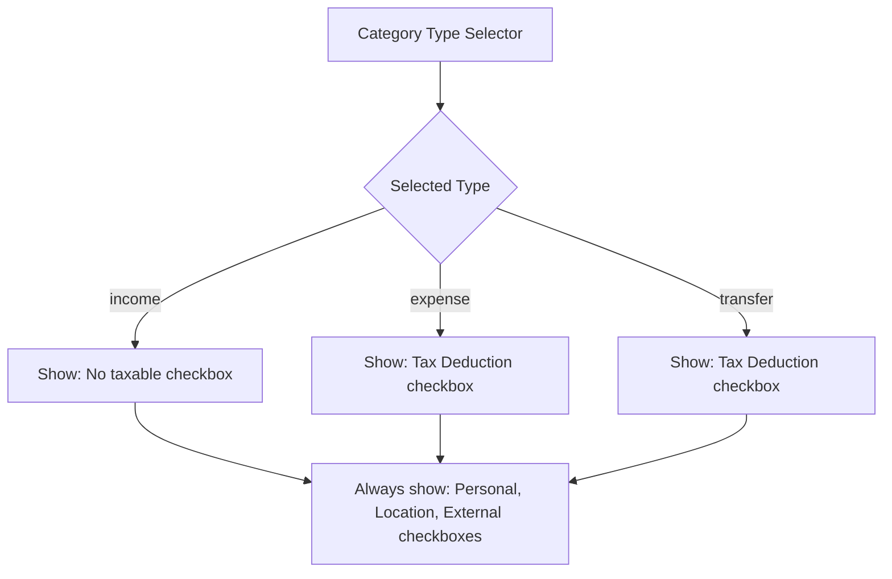

# Feature: Finance Categories — Tax Deduction Flag

**Date:** 2026-05-09 (Implemented)
**Revised:** 2026-05-09 (Simplified to single `isTaxDeduction` field)

## Overview

Add a single boolean flag [`isTaxDeduction`](../prisma/schema.prisma:571) to [`FinanceCategory`](../prisma/schema.prisma:556) to mark expense and transfer categories as tax-deductible. Income categories do **not** have a taxable flag. Build verified with `next build` — no type errors.

## Requirements

1. **Expense categories** → show a `Tax Deduction` checkbox
2. **Transfer categories** → show a `Tax Deduction` checkbox
3. **Income categories** → **no** taxable checkbox
4. All flags persist correctly (create + edit), and display visually in the category list

## Changes from Previous Implementation

Replaced the two separate fields (`isTaxableIncome`, `isTaxableExpense`) with a single unified field:
- `isTaxDeduction` — applies to both expense and transfer categories
- Income categories no longer have any taxable flag

## Data Model

Add one **optional boolean** column to the `FinanceCategory` table (default `false`):

| Field | Type | Default | Description |
|-------|------|---------|-------------|
| `isTaxDeduction` | `Boolean` | `false` | Whether this expense/transfer category is tax deductible |

## Files Modified

### 1. [`prisma/schema.prisma`](../prisma/schema.prisma)

Lines 571-572: Replaced `isTaxableIncome` and `isTaxableExpense` with:
```prisma
isTaxDeduction  Boolean  @default(false)
```

### 2. New Migration — `prisma/migrations/20260509130000_fix_category_tax_deduction_single_field/migration.sql`

```sql
ALTER TABLE "FinanceCategory" ADD COLUMN "isTaxDeduction" BOOLEAN NOT NULL DEFAULT false;
UPDATE "FinanceCategory" SET "isTaxDeduction" = true WHERE "isTaxableExpense" = true;
ALTER TABLE "FinanceCategory" DROP COLUMN "isTaxableIncome";
ALTER TABLE "FinanceCategory" DROP COLUMN "isTaxableExpense";
```

### 3. [`src/app/api/finance/categories/route.ts`](../src/app/api/finance/categories/route.ts)

**POST handler** (line 17): Destructure `isTaxDeduction` from `json` instead of `isTaxableIncome`/`isTaxableExpense`
**PUT handler** (line 64): Same change

### 4. [`src/app/(app)/finance/categories/page.tsx`](../src/app/(app)/finance/categories/page.tsx)

- **Category interface** (line 20): `isTaxableIncome: boolean; isTaxableExpense: boolean` → `isTaxDeduction: boolean`
- **Form state** (lines 54-58): Replace both fields with single `isTaxDeduction: false`
- **Editing pre-fill** (lines 72-76): Replace both fields with `isTaxDeduction: editing.isTaxDeduction`
- **Dialog form — Flags section** (lines 191-207): Replace two conditional checkboxes with single:
  - If type === `expense` OR type === `transfer` → show `Tax Deduction` checkbox
  - If type === `income` → no checkbox shown
- **CategoryRow — Flags display** (lines 268-270): `if (cat.isTaxDeduction) flags.push('TAX DEDUCTION')`

### 5. [`src/app/(app)/finance/OverviewClient.tsx`](../src/app/(app)/finance/OverviewClient.tsx)

- **`SerializedCategory` interface** (line 16): `isTaxableIncome: boolean; isTaxableExpense: boolean` → `isTaxDeduction: boolean`

### 6. [`src/app/(app)/finance/transactions/page.tsx`](../src/app/(app)/finance/transactions/page.tsx)

- **`Category` interface** (line 9): `isTaxableIncome: boolean; isTaxableExpense: boolean` → `isTaxDeduction: boolean`

## UI Logic — Conditional Checkbox



## UI — Category Row Flags Display

When viewing categories in the tree, the flags section will show `TAX DEDUCTION` when `isTaxDeduction` is `true`.

## Implementation Order

| Step | File | Description | Status |
|------|------|-------------|--------|
| 1 | [`prisma/schema.prisma`](../prisma/schema.prisma:571) | Update model fields | ✅ |
| 2 | Migration file | `20260509130000_fix_category_tax_deduction_single_field/migration.sql` | ✅ |
| 3 | Run migration | `npx prisma migrate deploy` | ✅ |
| 4 | [`src/app/api/finance/categories/route.ts`](../src/app/api/finance/categories/route.ts:17) | Update POST + PUT handlers | ✅ |
| 5 | [`src/app/(app)/finance/categories/page.tsx`](../src/app/(app)/finance/categories/page.tsx:16) | Interface, form state, dialog UI, flag display | ✅ |
| 6 | [`src/app/(app)/finance/OverviewClient.tsx`](../src/app/(app)/finance/OverviewClient.tsx:16) | Update `SerializedCategory` interface | ✅ |
| 7 | [`src/app/(app)/finance/transactions/page.tsx`](../src/app/(app)/finance/transactions/page.tsx:9) | Update `Category` interface | ✅ |
| 8 | Build verification | `npx next build` — compiled successfully, no type errors | ✅ |

## Testing

- Create an expense category → verify `Tax Deduction` checkbox appears, saves, and displays `TAX DEDUCTION` flag
- Create a transfer category → verify `Tax Deduction` checkbox appears, saves, and displays `TAX DEDUCTION` flag
- Create an income category → verify **no** taxable checkbox appears
- Edit each type → verify existing flags load correctly in the edit dialog
- Verify existing categories (without flag) behave correctly (default to `false`)
