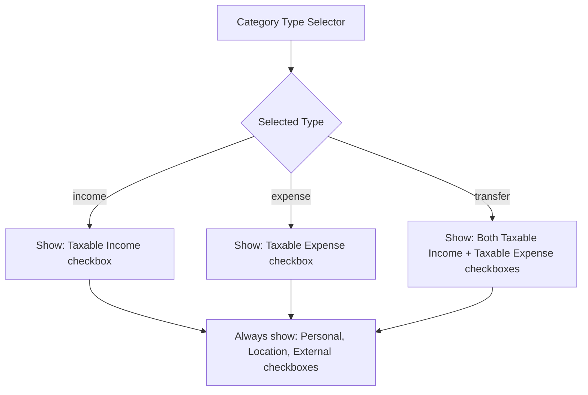

# Feature: Finance Categories — Taxable Income/Expense Flags

**Date:** 2026-05-09 (Implemented)

## Overview

Add boolean flags to [`FinanceCategory`](../prisma/schema.prisma:554) to mark categories as "taxable income" and/or "taxable expense", with conditional UI visibility based on category type. Build verified with `next build` — no type errors.

## Requirements

1. **Income categories** → show a `Taxable Income` checkbox
2. **Expense categories** → show a `Taxable Expense` checkbox
3. **Transfer categories** → show **both** `Taxable Income` and `Taxable Expense` checkboxes
4. All flags persist correctly (create + edit), and display visually in the category list

## Data Model

Add two **optional boolean** columns to the `FinanceCategory` table (default `false`):

| Field | Type | Default | Description |
|-------|------|---------|-------------|
| `isTaxableIncome` | `Boolean` | `false` | Whether this category represents taxable income |
| `isTaxableExpense` | `Boolean` | `false` | Whether this category represents a taxable expense |

## Files to Modify

### 1. [`prisma/schema.prisma`](../prisma/schema.prisma)

Add two fields to the `FinanceCategory` model after the existing `isExternal` field (line 568):

```prisma
isTaxableIncome  Boolean  @default(false)
isTaxableExpense Boolean  @default(false)
```

### 2. New Migration — `prisma/migrations/20260511100000_add_category_taxable_flags/migration.sql`

Create a migration file that adds the two columns to `FinanceCategory`:

```sql
-- AlterTable: FinanceCategory - add taxable flags
ALTER TABLE "FinanceCategory" ADD COLUMN "isTaxableIncome" BOOLEAN NOT NULL DEFAULT false;
ALTER TABLE "FinanceCategory" ADD COLUMN "isTaxableExpense" BOOLEAN NOT NULL DEFAULT false;
```

### 3. [`src/app/api/finance/categories/route.ts`](../src/app/api/finance/categories/route.ts)

**POST handler** (line 17):
- Destructure `isTaxableIncome` and `isTaxableExpense` from `json`
- Add to `data` object in `prisma.financeCategory.create` call

**PUT handler** (line 62):
- Destructure `isTaxableIncome` and `isTaxableExpense` from `json`
- Add conditional spread to `data` object in `prisma.financeCategory.update` call

### 4. [`src/app/(app)/finance/categories/page.tsx`](../src/app/(app)/finance/categories/page.tsx)

**Category interface** (line 17-22):
- Add `isTaxableIncome: boolean` and `isTaxableExpense: boolean`

**Form state** (lines 47-56):
- Add `isTaxableIncome: false` and `isTaxableExpense: false` to initial state

**Editing pre-fill** (lines 63-72):
- Add `isTaxableIncome: editing.isTaxableIncome` and `isTaxableExpense: editing.isTaxableExpense`

**Dialog form — Flags section** (lines 183-204):
- Replace the static flags row with **type-conditional** checkboxes:
  - If type === `income` → show only `Taxable Income` checkbox
  - If type === `expense` → show only `Taxable Expense` checkbox
  - If type === `transfer` → show **both** `Taxable Income` and `Taxable Expense` checkboxes
- Keep the existing `isPersonal`, `isLocationBased`, `isExternal` checkboxes as-is

**CategoryRow — Flags display** (lines 242-245):
- Add flag display for taxable status:
  - If `cat.isTaxableIncome` → show `TAXABLE INCOME` badge
  - If `cat.isTaxableExpense` → show `TAXABLE EXPENSE` badge

### 5. [`src/app/(app)/finance/OverviewClient.tsx`](../src/app/(app)/finance/OverviewClient.tsx)

- Add `isTaxableIncome: boolean` and `isTaxableExpense: boolean` to `SerializedCategory` interface (line 16)

### 6. [`src/app/(app)/finance/transactions/page.tsx`](../src/app/(app)/finance/transactions/page.tsx)

- Add `isTaxableIncome: boolean` and `isTaxableExpense: boolean` to `Category` interface (line 9)

### 7. [`src/lib/finance-seed.ts`](../src/lib/finance-seed.ts) (optional enhancement)

- No changes strictly required since defaults are `false`, but could optionally set sensible defaults:
  - Income categories like `Salary / Wages`, `Freelance / Contractor`, `Rental Income` → `isTaxableIncome: true`
  - Most expense categories → `isTaxableExpense: false` (too subjective to default)

## UI Logic — Conditional Checkboxes



## UI — Category Row Flags Display

When viewing categories in the tree, the flags section (currently showing `PRIVATE`, `LOCATION`, `EXTERNAL`) will also show `TAXABLE INCOME` and/or `TAXABLE EXPENSE` when the respective field is `true`.

## Implementation Order

| Step | File | Description | Status |
|------|------|-------------|--------|
| 1 | [`prisma/schema.prisma`](../prisma/schema.prisma:568) | Add model fields | ✅ |
| 2 | Migration file | `20260511100000_add_category_taxable_flags/migration.sql` | ✅ |
| 3 | Run `npx prisma db push` | Sync local DB (pre-existing migration issue bypassed) | ✅ |
| 4 | [`src/app/api/finance/categories/route.ts`](../src/app/api/finance/categories/route.ts:17) | Update POST + PUT handlers | ✅ |
| 5 | [`src/app/(app)/finance/categories/page.tsx`](../src/app/(app)/finance/categories/page.tsx:16) | Interface, form state, dialog UI, flag display | ✅ |
| 6 | [`src/app/(app)/finance/OverviewClient.tsx`](../src/app/(app)/finance/OverviewClient.tsx:16) | Update `SerializedCategory` interface | ✅ |
| 7 | [`src/app/(app)/finance/transactions/page.tsx`](../src/app/(app)/finance/transactions/page.tsx:9) | Update `Category` interface | ✅ |
| 8 | Build verification | `npx next build` — compiled successfully, no type errors | ✅ |

## Notes

- The migration `20260505000002_add_pin_hash_fields` has a pre-existing issue (references a `Document` table that doesn't exist in the current schema). Used `prisma db push` to sync the database schema directly instead of running all migrations from scratch.
- The seed file (`finance-seed.ts`) was left unchanged since default values are `false`, which is the correct safe default.

## Testing

- Create an income category → verify `Taxable Income` checkbox appears, saves, and displays `TAXABLE INCOME` flag
- Create an expense category → verify `Taxable Expense` checkbox appears, saves, and displays `TAXABLE EXPENSE` flag
- Create a transfer category → verify both checkboxes appear, save independently, and display correctly
- Edit each type → verify existing flags load correctly in the edit dialog
- Verify existing categories (without flags) behave correctly (default to `false`)
