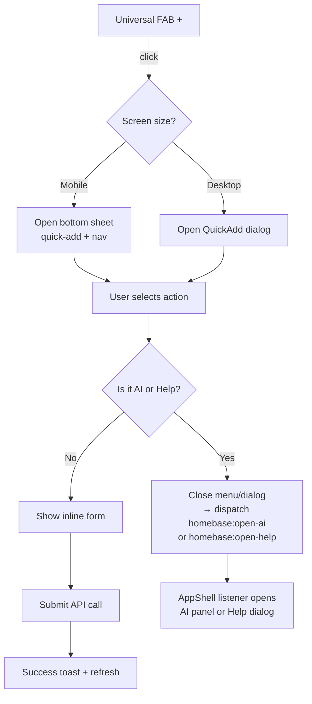

# Unified FAB — AI + Help Merged into Quick-Add Menu

**Status: ✅ Implemented** — 2026-05-10

## Problem Statement

1. **Three floating buttons** — The AI Assistant (`Bot` icon) and Help (`?` icon) lived as separate buttons in the top-right chrome alongside the bottom-right `+` FAB, cluttering the UI.
2. **Redundant entry points** — Users had multiple ways to access AI/Help, but they weren't consolidated.

## Solution

**Move AI and Help into the `+` quick-add menu** so there's only one floating button. They appear as action tiles in both the mobile bottom sheet and the desktop QuickAdd dialog.

### Rationale

- A single `+` FAB is the unified entry point for all quick actions — including AI and Help
- Users discover AI and Help naturally when they tap the `+` button
- No top-right chrome needed → cleaner page layout

---

## Architecture

### 1. Modified Components

| File | Action |
|------|--------|
| [`src/components/layout/UniversalFAB.tsx`](src/components/layout/UniversalFAB.tsx) | **MODIFY** — add `ai` and `help` to `QuickAction` type + quick actions array; dispatch `homebase:open-ai` / `homebase:open-help` events |
| [`src/components/layout/QuickAdd.tsx`](src/components/layout/QuickAdd.tsx) | **MODIFY** — add `ai` and `help` to action grid; `selectMode` closes dialog and dispatches open events |
| [`src/components/layout/AppShell.tsx`](src/components/layout/AppShell.tsx) | **MODIFY** — remove `<TopBarActions />`; add `useEffect` listeners for `homebase:open-ai` and `homebase:open-help` |
| [`src/components/layout/TopBarActions.tsx`](src/components/layout/TopBarActions.tsx) | **REMOVED from use** — no longer imported or rendered |

### 2. Component Details

#### `UniversalFAB.tsx` (New)
Single floating `+` button visible on all pages, both mobile and desktop.

- Fixed position: `bottom-6 right-6` (consistent across breakpoints)
- Styling: `w-14 h-14 rounded-full bg-primary text-primary-foreground shadow-lg`
- z-index: `z-50`
- **Mobile click**: opens a bottom sheet (moved from current [`QuickAdd.tsx`](src/components/layout/QuickAdd.tsx:242-335)) with quick-action grid + navigation grid
- **Desktop click**: dispatches `homebase:quickadd` event → opens QuickAdd dialog
- Button rotates 45° (plus → X) when dialog/sheet is open

#### `QuickAdd.tsx` (Modified)
Stripped of the mobile FAB + bottom sheet (now in UniversalFAB). Retains the Dialog + all form logic.

**Actions (including AI + Help):**

| Action | Icon | Trigger | Description |
|--------|------|---------|-------------|
| Event | `CalendarPlus` | QuickAdd dialog (form) | Add a calendar event |
| Chore | `ListChecks` | QuickAdd dialog (form) | Add a new chore |
| Expense | `DollarSign` | QuickAdd dialog (form) | Log a transaction |
| List Item | `ListPlus` | QuickAdd dialog (form) | Add to a list |
| Shopping List | `ShoppingCart` | QuickAdd dialog (form) | New shopping list |
| To-Do List | `CheckSquare` | QuickAdd dialog (form) | New to-do list |
| Recipe | `ChefHat` | QuickAdd dialog (form) | Add a recipe |
| Meal | `Utensils` | QuickAdd dialog (form) | Plan a meal |
| Note | `StickyNote` | QuickAdd dialog (form) | Write a note |
| **AI Assistant** | **`Bot`** | **Opens AI panel directly** | Voice or chat commands |
| **Help** | **`HelpCircle`** | **Opens Help dialog directly** | How to use this page |

**Dialog flow:** Category grid (step 1) → Inline form (step 2) → Success state (step 3) — same pattern as current.
For **AI** and **Help**, the QuickAdd dialog closes and dispatches `homebase:open-ai` / `homebase:open-help` events which [`AppShell`](src/components/layout/AppShell.tsx:19-29) listens for.

#### Event-Based Communication

AI and Help dialogs are opened via custom events, keeping the components decoupled:

| Event | Listener | Effect |
|-------|----------|--------|
| `homebase:open-ai` | [`AppShell`](src/components/layout/AppShell.tsx:19-29) `useEffect` | Sets `aiOpen = true` → renders `<AIAssistant>` panel |
| `homebase:open-help` | [`AppShell`](src/components/layout/AppShell.tsx:19-29) `useEffect` | Sets `helpOpen = true` → renders `<HelpButton>` dialog |

These events are dispatched from:
- [`UniversalFAB`](src/components/layout/UniversalFAB.tsx:106-114) — when user taps AI/Help in the mobile bottom sheet
- [`QuickAdd`](src/components/layout/QuickAdd.tsx:214-222) — when user clicks AI/Help in the desktop dialog action grid

#### `TopBarActions.tsx` (Removed)
No longer used. AI and Help are accessed exclusively through the `+` FAB menu.

#### `AppShell.tsx` (Modified)
Current structure:
```tsx
<div className="flex h-screen w-screen overflow-hidden">
  <OfflineBanner />
  <Sidebar />
  <main className="flex-1 overflow-hidden flex flex-col min-w-0 relative">
    <TopBarActions onOpenAI={...} onOpenHelp={...} />
    <div className="flex-1 overflow-hidden pb-16">{children}</div>
  </main>
  <UniversalFAB />
  <QuickAdd />
  <HelpButton />
  <AIAssistant />
</div>
```

Updated structure (no TopBarActions):
```tsx
<div className="flex h-screen w-screen overflow-hidden">
  <OfflineBanner />
  <Sidebar />
  <main className="flex-1 overflow-hidden flex flex-col min-w-0 relative">
    <div className="flex-1 overflow-hidden pb-16">{children}</div>
  </main>
  <UniversalFAB />
  <QuickAdd />        {/* Dialog only — triggered by event */}
  <HelpButton open={helpOpen} onOpenChange={setHelpOpen} />
  <AIAssistant open={aiOpen} onOpenChange={setAiOpen} />
</div>
```

---

## Visual Design

### FAB Button

```
        ┌─────────────┐
        │     ✕ / +   │   w-14 h-14 (56px)
        │   (rotate   │   bg-primary
        │   45° when  │   text-primary-foreground
        │   open)     │   shadow-lg
        └─────────────┘
               │
        bottom-6 right-6
```

### QuickAdd Dialog (Desktop) — includes AI + Help

```
┌─────────────────────────────────────────┐
│  ✕ Quick Add                            │
├─────────────────────────────────────────┤
│  ┌──────┐ ┌──────┐ ┌──────┐            │
│  │ 📅   │ │ 📋   │ │ 💰   │            │
│  │Event │ │Chore │ │Expense│            │
│  └──────┘ └──────┘ └──────┘            │
│  ┌──────┐ ┌──────┐ ┌──────┐            │
│  │ 🛒   │ │ 📝   │ │ 🍳   │            │
│  │List  │ │Note  │ │Recipe│            │
│  │Item  │ │      │ │      │            │
│  └──────┘ └──────┘ └──────┘            │
│  ┌──────┐ ┌──────┐ ┌──────┐            │
│  │ 🍽️   │ │ 📥   │ │ ✅   │            │
│  │ Meal │ │Shop  │ │To-Do │            │
│  │      │ │List  │ │List  │            │
│  └──────┘ └──────┘ └──────┘            │
│  ┌──────────┐ ┌──────────┐             │
│  │ 🤖 AI    │ │ ❓ Help  │             │
│  │ Assistant│ │          │             │
│  └──────────┘ └──────────┘             │
└─────────────────────────────────────────┘
```

*No separate Top-Right Actions Bar — AI and Help are now tiles within the QuickAdd dialog.*

---

## Flow Diagram



---

## Mobile Behavior

1. **FAB** sits at `bottom-6 right-6` on all screen sizes
2. **Tap FAB on mobile** → bottom sheet slides up with:
   - Quick-add actions grid at top, now including **AI Assistant** and **Help** tiles
   - Navigation grid below
3. **Tap FAB on desktop** → QuickAdd dialog opens with the same action grid including AI and Help

---

## Implementation Summary

### Files Modified

| File | Change |
|------|--------|
| [`src/components/layout/UniversalFAB.tsx`](src/components/layout/UniversalFAB.tsx) | Added `ai`/`help` to `QuickAction` type + quick actions array; dispatch `homebase:open-ai`/`homebase:open-help` events in `handleActionSelect` |
| [`src/components/layout/QuickAdd.tsx`](src/components/layout/QuickAdd.tsx) | Added `ai`/`help` to `QuickAction` type + actions array; `selectMode` closes dialog and dispatches open events for AI/Help |
| [`src/components/layout/AppShell.tsx`](src/components/layout/AppShell.tsx) | Removed `TopBarActions` import + usage; added `useEffect` listeners for `homebase:open-ai` and `homebase:open-help` |
| [`src/components/layout/TopBarActions.tsx`](src/components/layout/TopBarActions.tsx) | **No longer imported** — file kept but orphaned |
