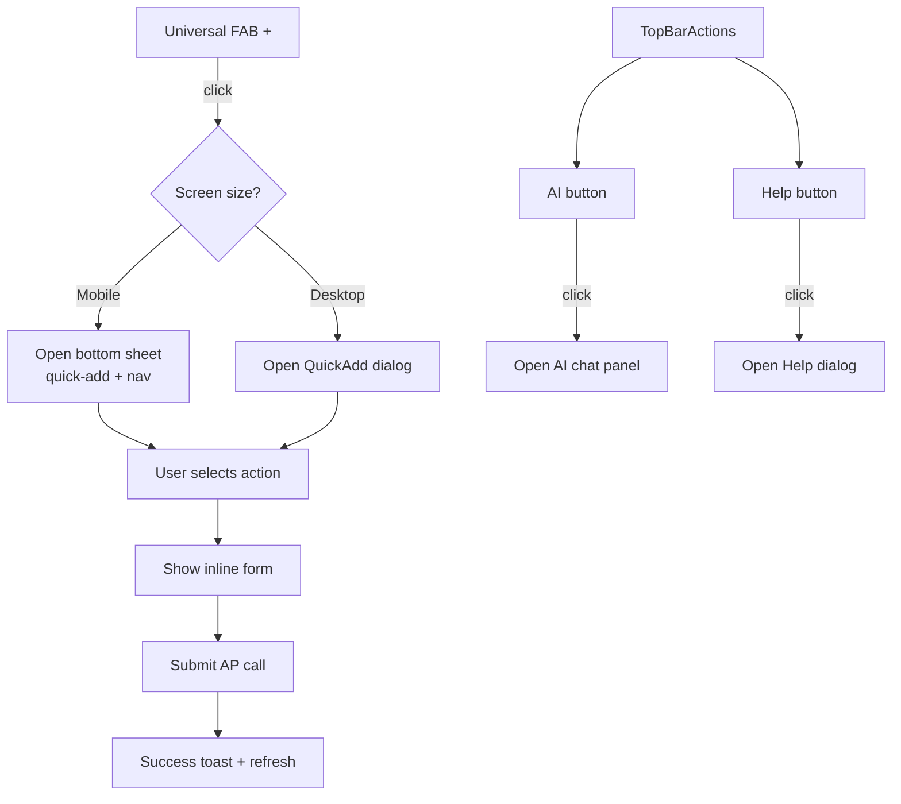

# Unified FAB + Top-Right Actions

**Status: ✅ Implemented** — 2026-05-09

## Problem Statement

1. **Cluttered bottom-right corner** — The AI Assistant button (`bottom-36 right-4`), Help button (`bottom-20 right-4`), and mobile FAB (`bottom-5 right-4`) stack vertically, obscuring page content.
2. **No desktop FAB** — On desktop, quick-add is only accessible via the sidebar button or `⌘K` keyboard shortcut. New users may not discover it.
3. **Missing quick actions** — The current [`QuickAdd`](src/components/layout/QuickAdd.tsx) supports Event, List, Recipe, Note. Users also need quick access to Chores, Expenses (finance), and adding items to existing lists.

## Proposed Solution: Option A (Recommended)

**Single universal FAB** (bottom-right on all screen sizes) + **AI/Help moved to top-right** of the page chrome.

### Rationale

- Quick-add is a **frequent** action — deserves a prominent, always-visible FAB
- AI Assistant and Help are **occasional** actions — better placed in the top-right chrome where they don't overlap content
- Separation of concerns keeps each interaction focused

---

## Architecture

### 1. New/Modified Components

| File | Action |
|------|--------|
| [`src/components/layout/UniversalFAB.tsx`](src/components/layout/UniversalFAB.tsx) | **NEW** — single floating `+` button for all screen sizes |
| [`src/components/layout/QuickAdd.tsx`](src/components/layout/QuickAdd.tsx) | **MODIFY** — strip out mobile FAB + bottom sheet, keep dialog + forms, add new action types |
| [`src/components/layout/TopBarActions.tsx`](src/components/layout/TopBarActions.tsx) | **NEW** — AI + Help icon buttons in top-right of main content area |
| [`src/components/layout/HelpButton.tsx`](src/components/layout/HelpButton.tsx) | **MODIFY** — remove fixed positioning, accept external `open`/`onOpenChange` props |
| [`src/components/ai/AIAssistant.tsx`](src/components/ai/AIAssistant.tsx) | **MODIFY** — remove floating trigger button, accept `open` prop |
| [`src/components/layout/AppShell.tsx`](src/components/layout/AppShell.tsx) | **MODIFY** — replace `<QuickAdd />` with `<UniversalFAB />`, add `<TopBarActions />` |

### 2. Component Details

#### `UniversalFAB.tsx` (New)
Single floating `+` button visible on all pages, both mobile and desktop.

- Fixed position: `bottom-6 right-6` (consistent across breakpoints)
- Styling: `w-14 h-14 rounded-full bg-primary text-primary-foreground shadow-lg`
- z-index: `z-50`
- **Mobile click**: opens a bottom sheet (moved from current [`QuickAdd.tsx`](src/components/layout/QuickAdd.tsx:242-335)) with quick-action grid + navigation grid
- **Desktop click**: dispatches `homebase:quickadd` event → opens QuickAdd dialog
- Button rotates 45° (plus → X) when dialog/sheet is open

#### `QuickAdd.tsx` (Modified)
Stripped of the mobile FAB + bottom sheet (now in UniversalFAB). Retains the Dialog + all form logic.

**New actions to add:**

| Action | Icon | API Endpoint | Quick Form Fields |
|--------|------|-------------|-------------------|
| Event | `CalendarPlus` | `POST /api/events` | Title + Date (already exists) |
| Chore | `ListChecks` | `POST /api/chores` | Title + Frequency (default: weekly) |
| Expense | `DollarSign` | `POST /api/finance/transactions` | Amount + Description + Category |
| List Item | `ListPlus` | `POST /api/lists/:id/items` | Pick a list + item content |
| Shopping List | `ShoppingCart` | `POST /api/lists` | Name (already exists) |
| To-Do List | `CheckSquare` | `POST /api/lists` | Name (already exists) |
| Recipe | `ChefHat` | `POST /api/recipes` | Title (already exists) |
| Meal | `CalendarDays` | `POST /api/meal-plan` | Date + Meal Type + Note |
| Note | `StickyNote` | `POST /api/notes` | Title + Content (already exists) |

**Dialog flow:** Category grid (step 1) → Inline form (step 2) → Success state (step 3) — same pattern as current.

#### `TopBarActions.tsx` (New)
AI + Help buttons in the top-right of the page chrome.

- **Positioning**: `absolute top-3 right-3` inside the `<main>` wrapper (not fixed — avoids overlapping page headers)
- Two compact icon buttons: `Bot` icon (AI) + `HelpCircle` icon (Help)
- AI button toggles AIAssistant panel open/closed
- Help button toggles HelpButton dialog open/closed
- Small size: `h-8 w-8` each, ghost variant, with tooltips

#### `HelpButton.tsx` (Modified)
- Remove `fixed bottom-20 right-4` positioning classes
- Remove the trigger button element
- Accept `open` and `onOpenChange` as props (controlled by TopBarActions)
- Keep Dialog and help content render logic unchanged

#### `AIAssistant.tsx` (Modified)
- Remove the floating trigger button (`fixed bottom-36 right-4 md:bottom-6 md:right-6`)
- Accept `open` and `onOpenChange` as props (controlled by TopBarActions)
- Keep the chat panel, message logic, microphone handling unchanged
- The panel positioning changes from `fixed bottom-52 right-4` to a dropdown anchored near the AI button

#### `AppShell.tsx` (Modified)
Current structure:
```tsx
<div className="flex h-screen w-screen overflow-hidden">
  <OfflineBanner />
  <Sidebar />
  <main className="flex-1 overflow-hidden flex flex-col min-w-0">
    <div className="flex-1 overflow-hidden pb-20 md:pb-0">
      {children}
    </div>
  </main>
  <QuickAdd />
  <HelpButton />
  <AIAssistant />
</div>
```

New structure:
```tsx
<div className="flex h-screen w-screen overflow-hidden">
  <OfflineBanner />
  <Sidebar />

  <main className="flex-1 overflow-hidden flex flex-col min-w-0 relative">
    <TopBarActions
      onOpenAI={() => setAiOpen(true)}
      onOpenHelp={() => setHelpOpen(true)}
    />
    <div className="flex-1 overflow-hidden pb-20 md:pb-0">
      {children}
    </div>
  </main>

  <UniversalFAB />
  <QuickAdd />        {/* Dialog only — triggered by event */}
  <HelpButton open={helpOpen} onOpenChange={setHelpOpen} />
  <AIAssistant open={aiOpen} onOpenChange={setAiOpen} />
</div>
```

---

## Visual Design

### FAB Button

```
        ┌─────────────┐
        │     ✕ / +   │   w-14 h-14 (56px)
        │   (rotate   │   bg-primary
        │   45° when  │   text-primary-foreground
        │   open)     │   shadow-lg
        └─────────────┘
               │
        bottom-6 right-6
```

### QuickAdd Dialog (Desktop)

```
┌─────────────────────────────────────┐
│  ✕ Quick Add                        │
├─────────────────────────────────────┤
│  ┌──────┐ ┌──────┐ ┌──────┐        │
│  │ 📅   │ │ 📋   │ │ 💰   │        │
│  │Event │ │Chore │ │Expense│        │
│  └──────┘ └──────┘ └──────┘        │
│  ┌──────┐ ┌──────┐ ┌──────┐        │
│  │ 🛒   │ │ 📝   │ │ 🍳   │        │
│  │List  │ │Note  │ │Recipe│        │
│  │Item  │ │      │ │      │        │
│  └──────┘ └──────┘ └──────┘        │
│  ┌──────┐ ┌──────┐ ┌──────┐        │
│  │ 🍽️   │ │ 📥   │ │ ✅   │        │
│  │ Meal │ │Shop  │ │To-Do │        │
│  │      │ │List  │ │List  │        │
│  └──────┘ └──────┘ └──────┘        │
└─────────────────────────────────────┘
```

### Top-Right Actions Bar

```
┌──────────────────────────────────────────────────┐
│                                          ┌──┐ ┌──┐│
│   [Page Content]                         │🤖│ │❓││
│                                          └──┘ └──┘│
│                                                  │
│          absolute top-3 right-3                  │
└──────────────────────────────────────────────────┘
```

---

## Flow Diagram



---

## Mobile Behavior

1. **FAB** sits at `bottom-6 right-6` on all screen sizes
2. **Tap FAB on mobile** → bottom sheet slides up with:
   - Quick-add actions grid at top (same as now)
   - Navigation grid below (same as now)
   - **AI + Help icon buttons** added in the sheet header area (drag handle row) for discoverability
3. **Tap FAB on desktop** → QuickAdd dialog opens directly

---

## Implementation Order

### Step 1: Create [`UniversalFAB.tsx`](src/components/layout/UniversalFAB.tsx)
- New component with the floating `+` button
- Move mobile bottom sheet logic from `QuickAdd.tsx` into this component
- Dispatch `homebase:quickadd` event for desktop to open dialog
- Handle 45° rotation animation when open

### Step 2: Create [`TopBarActions.tsx`](src/components/layout/TopBarActions.tsx)
- Small component with AI + Help icon buttons
- `absolute top-3 right-3` within the main wrapper
- Accept `onOpenAI` and `onOpenHelp` callbacks
- Ghost/styled button variants with tooltips

### Step 3: Modify [`HelpButton.tsx`](src/components/layout/HelpButton.tsx)
- Accept `open` and `onOpenChange` props
- Remove trigger button element
- Remove all fixed positioning classes

### Step 4: Modify [`AIAssistant.tsx`](src/components/ai/AIAssistant.tsx)
- Accept `open` and `onOpenChange` props
- Remove floating trigger button
- Adjust panel positioning for a top-anchored dropdown layout

### Step 5: Modify [`QuickAdd.tsx`](src/components/layout/QuickAdd.tsx)
- Remove mobile FAB + bottom sheet (moved to UniversalFAB)
- Add new action types: Chore, Expense, List Item, Meal
- Add corresponding form fields and API calls for each new type

### Step 6: Modify [`AppShell.tsx`](src/components/layout/AppShell.tsx)
- Replace `<QuickAdd />` with `<UniversalFAB />`
- Add `<TopBarActions />` inside main wrapper
- Wire up AI/Help open state (useState at AppShell level)
- Remove `pb-20` padding (no longer needed since FAB is now universal)
