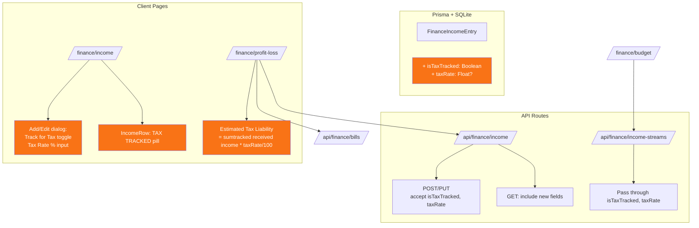

# Income Tax Tracking for ATO Compliance — Build Plan

**Date:** 2026-05-10
**Project:** `c:/Appdev/HomeBase`
**Stack:** Next.js 15 (App Router), TypeScript, Prisma + SQLite, Tailwind, shadcn/ui

---

## Overview

Add tax-tracking capability to income streams so users can:
1. Flag income entries for ATO/tax tracking with an optional tax rate
2. See a visual pill on income rows showing tax-tracked status
3. View estimated tax liability in the P&L report (auto-calculated)
4. Add actual ATO tax payment bills/expenses manually (existing functionality)

---

## Requirements

| # | Requirement | Type |
|---|-------------|------|
| 1 | Add `isTaxTracked` (boolean) + `taxRate` (optional float %) to income entries | DB/API |
| 2 | Toggle + tax rate input in Income add/edit dialog | UI |
| 3 | Visual pill on income rows showing "TAX TRACKED" + rate badge | UI |
| 4 | P&L page shows "Estimated Tax Liability" line calculated from tracked income | UI/Calc |
| 5 | Users can create ATO payment bills as normal expenses (existing functionality) | Existing |
| 6 | Pass through tax fields to income-streams API for budget page alignment | API |

---

## Architecture



---

## Step-by-Step Plan

### Step 1: Database — Prisma Schema

**File:** [`prisma/schema.prisma`](../prisma/schema.prisma) — `FinanceIncomeEntry` model (after line ~730)

Add two new fields:

```prisma
isTaxTracked  Boolean  @default(false)   // Track this income for ATO/tax purposes
taxRate       Float?                     // Estimated tax rate (e.g. 30 for 30%). Null = not set
```

**Why nullable `taxRate`?** Some income streams are tax-free (tax refunds, gifts) — flagging them as tracked with no rate means "report this income but don't estimate tax on it".

### Step 2: Create Prisma Migration

```bash
npx prisma migrate dev --name add_income_tax_tracking
```

Auto-generates: `prisma/migrations/YYYYMMDDHHMMSS_add_income_tax_tracking/migration.sql`

Migration SQL:
```sql
ALTER TABLE "FinanceIncomeEntry" ADD COLUMN "isTaxTracked" BOOLEAN NOT NULL DEFAULT false;
ALTER TABLE "FinanceIncomeEntry" ADD COLUMN "taxRate" REAL;
```

### Step 3: API — Income Route

**File:** [`src/app/api/finance/income/route.ts`](../src/app/api/finance/income/route.ts)

**POST handler** (line ~31): Add `isTaxTracked`, `taxRate` to destructured body and create data.

**PUT handler** (line ~80): Add `isTaxTracked`, `taxRate` to destructured body and conditional update.

**GET handler**: No changes — Prisma auto-includes new fields via the existing `include`.

**PATCH handler**: No changes — PATCH is for received/invoiceReceived only.

### Step 4: API — Income Streams Route

**File:** [`src/app/api/finance/income-streams/route.ts`](../src/app/api/finance/income-streams/route.ts)

Update the `IncomeStream` interface to include `isTaxTracked` and `taxRate`.
Update the mapper function to pass through these fields from `FinanceIncomeEntry`.

### Step 5: Income Page — Tax Toggle & Rate Input

**File:** [`src/app/(app)/finance/income/page.tsx`](../src/app/(app)/finance/income/page.tsx)

#### 5a. Update `IncomeEntry` interface (line ~33)
Add: `isTaxTracked: boolean` and `taxRate: number | null`

#### 5b. Add to empty form state (line ~100)
```typescript
isTaxTracked: false,
taxRate: '',
```

#### 5c. Add to edit pre-fill (line ~212)
```typescript
isTaxTracked: e.isTaxTracked ?? false,
taxRate: e.taxRate != null ? String(e.taxRate) : '',
```

#### 5d. Add to save payload (line ~256)
```typescript
isTaxTracked: form.isTaxTracked,
taxRate: form.taxRate ? parseFloat(form.taxRate) : null,
```

#### 5e. Add UI section in dialog

Insert after the entity/vendor fields block, before the notes field:

```tsx
{/* ── Tax Tracking ────────────────────────────── */}
<div className="border-t border-border pt-4 mt-4">
  <h3 className="text-xs font-semibold text-muted-foreground uppercase tracking-wider mb-3">
    Tax Tracking
  </h3>
  <div className="space-y-3">
    <label className="flex items-center gap-2 text-sm cursor-pointer">
      <input type="checkbox" checked={form.isTaxTracked}
        onChange={e => setForm(p => ({ ...p, isTaxTracked: e.target.checked }))}
        disabled={saving} className="accent-orange-500" />
      <ReceiptText className="h-4 w-4 text-orange-500" />
      <span className="font-medium">Track for ATO / tax purposes</span>
    </label>

    {form.isTaxTracked && (
      <div className="ml-6">
        <label className="text-xs text-muted-foreground">Estimated tax rate (%)</label>
        <div className="flex items-center gap-2 mt-1">
          <input type="number" min="0" max="100" step="0.1"
            value={form.taxRate}
            onChange={e => setForm(p => ({ ...p, taxRate: e.target.value }))}
            disabled={saving}
            className="flex h-9 w-24 rounded-md border border-input bg-transparent px-3 py-1 text-sm shadow-sm outline-none focus:border-primary" />
          <span className="text-sm text-muted-foreground">%</span>
        </div>
        <p className="text-xs text-muted-foreground mt-1">
          Estimated tax will appear in P&L reports. Leave empty if tax-free.
        </p>
      </div>
    )}
  </div>
</div>
```

#### 5f. IncomeRow — Show TAX TRACKED pill

In the `IncomeRow` component, add a pill near the existing badges (after the RECEIVED badge or hasRemittance indicator):

```tsx
{entry.isTaxTracked && (
  <span className="text-[10px] bg-orange-500/10 text-orange-600 dark:text-orange-400 px-1.5 py-0.5 rounded-full flex items-center gap-1 font-medium">
    <ReceiptText className="h-2.5 w-2.5" />
    TAX{entry.taxRate ? ` ${entry.taxRate}%` : ''}
  </span>
)}
```

#### 5g. Add Tax Tracked quick-filter button

In the filter bar (near date range / category filters), add:

```tsx
<button onClick={() => setQuickFilterTaxTracked(prev => !prev)}
  className={cn('text-xs px-2 py-1 rounded-full border transition-colors',
    quickFilterTaxTracked
      ? 'bg-orange-500/10 border-orange-500/30 text-orange-600'
      : 'border-border text-muted-foreground hover:bg-accent'
  )}>
  <ReceiptText className="h-3 w-3 inline mr-1" />
  Tax Tracked
</button>
```

Add state: `const [quickFilterTaxTracked, setQuickFilterTaxTracked] = useState(false)`

Add filter logic in `visibleEntries` computation:
```typescript
if (quickFilterTaxTracked && !e.isTaxTracked) return false
```

### Step 6: P&L Page — Estimated Tax Liability

**File:** [`src/app/(app)/finance/profit-loss/page.tsx`](../src/app/(app)/finance/profit-loss/page.tsx)

#### 6a. Update `IncomeEntry` interface (line ~27)
Add: `isTaxTracked: boolean` and `taxRate: number | null`

#### 6b. Calculate estimated tax

After the `totalIncome` / `totalExpenses` computations (around line 193):

```typescript
const estimatedTax = useMemo(() => {
  return relevantIncome.reduce((sum, e) => {
    if (!e.isTaxTracked || !e.taxRate) return sum
    const isOneOff = e.incomeType === 'one-off'
    const periodAmt = isOneOff ? e.amount : toPeriodAmount(e.amount, e.frequency, periodMonths)
    return sum + (periodAmt * (e.taxRate / 100))
  }, 0)
}, [relevantIncome, periodMonths])
```

#### 6c. Estimated Tax card in summary bar

Add a fourth summary card (orange-themed) after the Total Expenses card:

```tsx
<div className="rounded-lg border border-border p-3 bg-orange-500/5 border-orange-500/20">
  <div className="flex items-center gap-1.5 text-xs text-muted-foreground mb-1">
    <ReceiptText className="h-3 w-3 text-orange-500" />
    <span>Estimated Tax (ATO)</span>
    <Info className="h-3 w-3 text-muted-foreground" />
  </div>
  <p className="text-xl font-bold text-orange-600 dark:text-orange-400">
    {fmtCurrency(estimatedTax)}
  </p>
  <p className="text-xs text-muted-foreground mt-0.5">Based on tax-tracked income</p>
</div>
```

#### 6d. Estimated Tax line in Expenses breakdown

At the end of the expenses section, add the estimated tax line:

```tsx
{estimatedTax > 0 && (
  <div className="flex items-center justify-between py-1.5 px-1.5 -mx-1.5 rounded-md bg-orange-500/5">
    <div className="flex items-center gap-2">
      <ReceiptText className="h-3.5 w-3.5 text-orange-500" />
      <span className="text-sm font-medium">Estimated Tax Liability (ATO)</span>
      <span className="text-[10px] bg-orange-500/10 text-orange-600 px-1.5 rounded font-medium">ESTIMATED</span>
    </div>
    <span className="text-sm font-semibold text-orange-600">{fmtCurrency(estimatedTax)}</span>
  </div>
)}
```

#### 6e. Update Net P&L

The net calculation should include estimated tax:
```typescript
const netProfitLoss = totalIncome - totalExpenses - estimatedTax
```

Update the Net P&L summary card accordingly and add a tooltip explaining this includes estimated tax.

### Step 7: Build & Verify

```bash
npm run build
```

Confirm zero typeScript errors and no breaking changes.

---

## File Checklist

### Files to Modify (5 files)

| # | File | Changes |
|---|------|---------|
| 1 | `prisma/schema.prisma` | Add `isTaxTracked` + `taxRate` to `FinanceIncomeEntry` |
| 2 | `src/app/api/finance/income/route.ts` | Accept `isTaxTracked`/`taxRate` in POST/PUT |
| 3 | `src/app/api/finance/income-streams/route.ts` | Pass through `isTaxTracked`/`taxRate` |
| 4 | `src/app/(app)/finance/income/page.tsx` | Form fields, tax pill, tax filter |
| 5 | `src/app/(app)/finance/profit-loss/page.tsx` | Estimated tax calc + display |

### Files Auto-Generated (1 file)

| # | File | Purpose |
|---|------|---------|
| 1 | `prisma/migrations/XXXXXXXXXXXX_add_income_tax_tracking/migration.sql` | Auto-generated |

### Files Confirmed NO Changes Needed

| File | Reason |
|------|--------|
| `src/app/(app)/finance/layout.tsx` | No new tabs needed |
| `src/app/(app)/finance/income/received/page.tsx` | Imports types from income/page.tsx — auto-updates |
| `src/app/(app)/finance/budget/page.tsx` | Gets income data via income-streams API (Step 4) |
| `src/app/(app)/finance/categories/page.tsx` | Existing `isTaxDeduction` unchanged |
| `src/types/index.ts` | No shared types need updating |

---

## UI Mockups

### Income Row with Tax Pill
```
  [TrendingUp] Salary - May  [RECURRING]  [TAX 30%]           $5,000.00
  Next: 15 May 2026  |  Employer Pty Ltd
  [Edit]  [Mark Received]  [Delete]
```

### Add/Edit Income Dialog - Tax Section
```
┌─ Tax Tracking ─────────────────────────────────────┐
│                                                     │
│ ☑ Track for ATO / tax purposes                     │
│   (ReceiptText icon in orange)                     │
│                                                     │
│   Tax rate (%): [ 30  ] %  (optional)               │
│   Estimated tax will appear in P&L reports.         │
│   Leave empty if this income is tax-free.           │
└─────────────────────────────────────────────────────┘
```

### P&L Summary Bar - 4 Cards
```
┌──────────────┐  ┌──────────────┐  ┌──────────────────┐  ┌──────────────────────┐
│ Total Income │  │ Total Exp.   │  │ Estimated Tax    │  │ Net P&L              │
│   $12,000    │  │   $8,500     │  │   $1,050         │  │   $2,450             │
│   (green)    │  │   (red)      │  │   (orange)       │  │   (green/red)        │
└──────────────┘  └──────────────┘  └──────────────────┘  └──────────────────────┘
```

---

## Testing Checklist

| # | Test | Expected |
|---|------|----------|
| 1 | Create income with "Track for ATO" checked | Tax pill appears on row |
| 2 | Create income without tracking | No tax pill |
| 3 | Set tax rate on income entry | Pill shows "TAX 30%" |
| 4 | Edit income entry | Tax fields load correctly |
| 5 | Remove tax tracking | Pill disappears |
| 6 | P&L with tracked income | Estimated Tax card shows |
| 7 | P&L Cash vs Forecast toggle | Tax calc updates accordingly |
| 8 | P&L Net calculation | Net = Income - Expenses - Estimated Tax |
| 9 | Income streams API | Returns isTaxTracked/taxRate fields |
| 10 | Build | `npm run build` passes with zero errors |

---

## Deployment

```bash
# After schema changes:
npx prisma migrate dev --name add_income_tax_tracking

# Migration auto-runs on NAS container start via entrypoint.sh
# Commit to git after local build is confirmed solid
```
