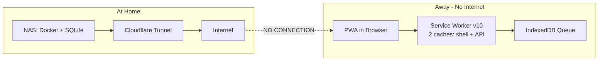

# HomeBase Offline Readiness Audit — July 2026

**Context:** Mobile PWA (phone/tablet) → Cloudflare Tunnel → Synology NAS (HomeBase Docker + SQLite). When off-grid, the PWA has zero connectivity to the server.

**Overall Verdict:** The core daily-use features (lists, calendar, chores, meal plan, recipes) are well-prepared. Finance, documents, and settings are read-only at best. Authentication is the #1 risk.

---

## Architecture Overview

### How it works when offline

1. **Page loads:** SW intercepts navigation → serves cached HTML from `homebase-shell-v10`
2. **Client-side nav (React):** SW intercepts RSC fetch → serves cached RSC payload from `homebase-api-v10` under `?__rsc_cache` key
3. **Data APIs:** SW returns cached JSON (stale-while-revalidate for reference data, cache-fallback for mutable collections)
4. **Mutations:** Queued in IndexedDB (`homebase-offline-queue`) → replayed in order when online
5. **Reconnect:** `useGlobalOfflineFlush` replays entire queue; views refetch affected collections

---

## Feature-by-Feature Offline Readiness

### Shopping & Todo Lists — FULLY OFFLINE-CAPABLE

Every CRUD operation is queued in IndexedDB and replays on reconnect: add, toggle, delete, reorder, category change, lock/unlock, clear completed. Uses `tmp_` IDs for optimistic inserts, fixed queue keys so successive edits collapse. The only gap: adding new categories is blocked offline.

Files: `src/hooks/lists/useShoppingList.ts`, `src/hooks/lists/useTodoList.ts`, `src/hooks/lists/useOfflineQueue.ts`

### Calendar — MOSTLY OFFLINE-CAPABLE

Create, edit, and delete events (including recurring occurrence exceptions) all queue offline. Uses `clientMutationId` for idempotent replay. The SW caches `/api/events` for the current month; navigating beyond cached range returns stale/no data. Chore completions triggered from calendar views also queue.

Files: `src/lib/calendar-offline.ts`, `src/components/calendar/EventModal.tsx`

### Chores — VIEW + COMPLETE ONLY

Viewing the schedule works from SW cache. Completing a chore queues a POST with `clientMutationId` (idempotent). Creating, editing, deleting, or rotating chores is not queued.

Files: `src/lib/chores-offline.ts`, `src/components/dashboard/ChoreScheduleCard.tsx`

### Meal Plan — MOSTLY OFFLINE-CAPABLE

Slot assignments, removals, moves, and drag-drop from recipe lists all queue as idempotent whole-slot state POSTs. Deleting a slot queues a DELETE. The gap: clearing the entire plan is blocked offline. Navigating to weeks never visited online shows cached fallback.

Files: `src/lib/meal-plan-offline.ts`, `src/hooks/meal-plan/useMealPlanDragDrop.ts`

### Recipes — READ-ONLY

The SW warms the recipe list + top 20 detail pages (full HTML+RSC) + images. Recipes 21-200 get RSC-only warming (client-side nav works). No offline mutations.

### Finance — READ-ONLY, STALE DATA

Pages load from SW cache (HTML/RSC) but show the last-visit snapshot. No finance API routes are in the SW cache patterns — all finance data fetches will fail offline. Zero offline mutation support — by design, since accounting integrity requires server-side validation. Do not attempt to create bills, record payments, or post journals offline.

### Contacts, Notes, Documents, Trips — READ-ONLY

Pages load from cache. No offline mutation support for any of these modules. Document content is not cached.

### Authentication — THE #1 RISK

| Scenario | Works? |
|----------|--------|
| App already open, switching tabs | Yes |
| Close & reopen browser while offline | Depends on cookie persistence |
| JWT expires while offline (30-day default) | Locked out |
| Fresh PWA install while offline | Cannot log in |

The `session` callback in `auth.ts:58` always calls `prisma.user.findUnique()` — it has no fallback. If the browser tries server-side rendering instead of using the SW cache, `requireSession()` fails and redirects to `/login`, which also fails. NextAuth v5 JWT default maxAge is 30 days, so expiry during a typical trip is unlikely.

---

## What's Changed Since `offline-support.md`

The `docs/offline-support.md` document references v5 caches and describes a more limited system. The code has significantly outgrown the docs:

| Doc Says | Actual Code (July 2026) |
|----------|------------------------|
| Delete/reorder/category change "online only" | All queued now |
| Calendar/contacts/notes "mutations don't work" | Calendar mutations DO work |
| Meal plan editing "doesn't work" | Slot edits ARE queued |
| Chores not mentioned at all | Completion IS queued |
| 6 pages warmed | 13 pages + 200 recipes + data APIs |
| Cache v5 | Cache v10 |

---

## Pre-Trip Checklist (No Code Changes Needed)

1. **Warm the cache:** Open every page you'll need while online — especially navigate calendar months and meal plan weeks ahead
2. **Install the PWA** to your home screen — prevents browser cache eviction
3. **Keep a browser tab open** — don't force-close; the session cookie must survive
4. **Turn off Data Saver** — the SW skips page/image warming when Data Saver is on
5. **Test before leaving:** Chrome DevTools → Network → Offline, then navigate key pages
6. **Know what NOT to attempt offline:** finance mutations, settings changes, recipe creation, document uploads, new category creation

---

## Files Referenced

| File | Role |
|------|------|
| `public/sw.js` | Service worker v10: two-cache architecture, cache warming, Background Sync, fetch routing |
| `public/offline.html` | Fallback page for uncached navigation |
| `src/lib/offline-queue.ts` | IndexedDB mutation queue: enqueue, flush, replay, idempotency |
| `src/lib/calendar-offline.ts` | Calendar event CRUD queued for offline replay |
| `src/lib/chores-offline.ts` | Chore completion queued for offline replay |
| `src/lib/meal-plan-offline.ts` | Meal plan slot state queued for offline replay |
| `src/hooks/useGlobalOfflineFlush.ts` | Global queue flusher mounted in AppShell |
| `src/hooks/lists/useOfflineQueue.ts` | Per-list queue integration + refetch on flush |
| `src/hooks/lists/useShoppingList.ts` | Offline-aware shopping list CRUD |
| `src/hooks/lists/useTodoList.ts` | Offline-aware todo list CRUD |
| `src/hooks/meal-plan/useMealPlanDragDrop.ts` | Offline-aware meal plan drag-drop |
| `src/components/layout/OfflineBanner.tsx` | Connection status + pending sync count banner |
| `src/components/layout/AppShell.tsx` | App shell mounting OfflineBanner + global flusher |
| `src/app/api/warm/route.ts` | API returning recipe IDs, images, and data API URLs for SW warming |
| `src/app/layout.tsx` | SW registration, idle warm-up, periodic sync, storage persistence |
| `src/lib/auth.ts` | NextAuth v5 config with credentials provider + JWT strategy |
| `src/lib/auth-helpers.ts` | `requireSession()` / `requireAdmin()` guards |
