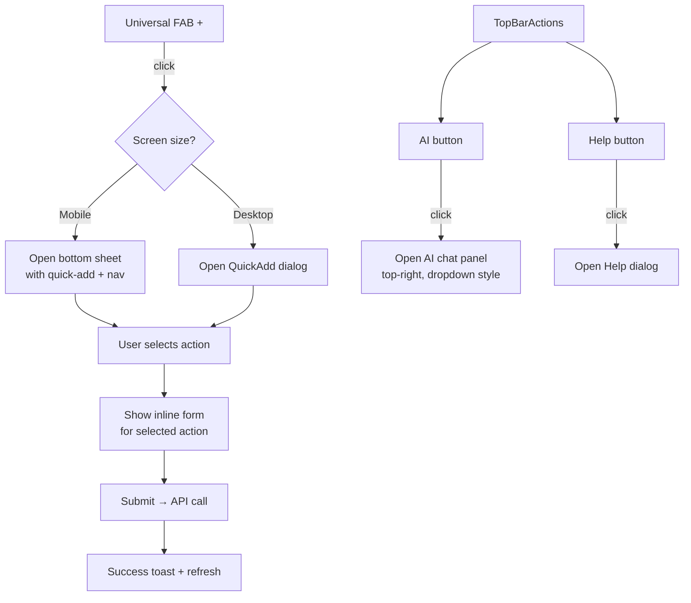

# Unified FAB + Top-Right Actions

## Problem Statement

1. **Cluttered bottom-right corner** — The AI Assistant button (`bottom-36 right-4`), Help button (`bottom-20 right-4`), and mobile FAB (`bottom-5 right-4`) stack vertically, obscuring page content.
2. **No desktop FAB** — On desktop, quick-add is only accessible via the sidebar button or `⌘K` keyboard shortcut. New users may not discover it.
3. **Missing quick actions** — The current QuickAdd supports Event, List, Recipe, Note. Users also need quick access to Chores, Expenses (finance), and adding items to existing lists.

## Proposed Solution: Option A (Recommended)

**Single universal FAB** (bottom-right on all screen sizes) + **AI/Help moved to top-right** of the page chrome.

### Rationale

- Quick-add is a **frequent** action — deserves a prominent, always-visible FAB
- AI Assistant and Help are **occasional** actions — better placed in the top-right chrome where they don't overlap content
- Separation of concerns keeps each interaction focused

---

## Architecture

### 1. New/Modified Components

```
src/components/layout/
├── UniversalFAB.tsx          ← NEW: replaces mobile-specific QuickAdd FAB
├── QuickAdd.tsx              ← MODIFIED: strip out mobile FAB, keep dialog logic
├── AppShell.tsx              ← MODIFIED: replace QuickAdd → UniversalFAB, add TopBarActions
├── TopBarActions.tsx         ← NEW: AI + Help buttons in top-right
├── HelpButton.tsx            ← MODIFIED: remove fixed positioning, use inline
├── AIAssistant.tsx           ← MODIFIED: remove fixed floating button, accept open trigger
```

### 2. Component Responsibilities

#### `UniversalFAB.tsx`
**Purpose:** Single floating `+` button visible on all pages, both mobile and desktop.

- Fixed position: `bottom-6 right-6` (both mobile & desktop)
- Styling: `w-14 h-14 rounded-full bg-primary text-primary-foreground shadow-lg`
- z-index: `z-50`
- On click: dispatches a custom event `homebase:open-quickadd` (reusing existing `homebase:quickadd` pattern) to open the QuickAdd dialog
- On mobile: also opens the bottom sheet (same as current mobile behavior)
- On desktop: opens the QuickAdd dialog directly

#### `QuickAdd.tsx` (Modified)
**Purpose:** The quick-add dialog/sheet. Stripped of the mobile FAB button (now in UniversalFAB).

**New actions to add:**
| Action | Icon | API Endpoint | Notes |
|--------|------|-------------|-------|
| Event | `CalendarPlus` | `POST /api/events` | Already exists |
| Chore | `ListChecks` | `POST /api/chores` | Quick form: title + frequency (default weekly) |
| Expense | `DollarSign` | `POST /api/finance/transactions` | Quick form: amount + description + category selector |
| To List Item | `ListPlus` | `POST /api/lists/:id/items` | Pick a list, add item content |
| Shopping List | `ShoppingCart` | `POST /api/lists` | Already exists (new list) |
| To-Do List | `CheckSquare` | `POST /api/lists` | Already exists (new todo list) |
| Recipe | `ChefHat` | `POST /api/recipes` | Already exists |
| Meal | `CalendarDays` | `POST /api/meal-plan` | Date + meal type + note |
| Note | `StickyNote` | `POST /api/notes` | Already exists |

**Dialog layout:**
- Step 1: Category grid (2-3 columns on desktop, 2 columns on mobile) showing all action types with icons
- Step 2: Inline form for the selected action (same pattern as current)
- Step 3: Success state (same as current)

#### `TopBarActions.tsx` (New)
**Purpose:** AI Assistant + Help buttons positioned in the top-right of the page chrome.

- Fixed position: `top-4 right-4 z-50`
- Two compact icon buttons side-by-side:
  - AI: `Bot` icon + small "AI" badge
  - Help: `HelpCircle` icon
- On mobile, could be placed inside the sidebar's top bar area instead to avoid overlap with page headers
- Better approach: render inside the `main` area's top-right, not as fixed elements (avoids overlap with page-specific headers)

**Alternative positioning strategy:**
- Place `TopBarActions` inside the `<main>` wrapper, using `absolute top-3 right-3` within a `relative` container
- The `<main>` already has `flex flex-col`, so we'd add a thin header bar at the top:
  ```
  <main className="flex-1 overflow-hidden flex flex-col min-w-0 relative">
    <TopBarActions />  {/* absolute top-3 right-3 */}
    <div className="flex-1 overflow-hidden pb-20 md:pb-0">
      {children}
    </div>
  </main>
  ```
- This keeps them out of the way of page content titles while still being accessible

#### `HelpButton.tsx` (Modified)
**Purpose:** Remove fixed positioning. Accept an `open` prop or render inline within `TopBarActions`.

- Remove `fixed bottom-20 right-4` classes
- Remove the trigger button (now rendered by `TopBarActions`)
- Keep the Dialog component
- Expose `open`/`onOpenChange` props, or keep internal state and expose a `helpOpen` flag via event

#### `AIAssistant.tsx` (Modified)
**Purpose:** Remove floating trigger button. Accept an external trigger.

- Remove `fixed bottom-36 right-4 md:bottom-6 md:right-6` floating button
- Keep the chat panel and all logic
- Add an `open` prop so `TopBarActions` can control it
- OR keep internal state but listen for a custom event (`homebase:open-ai`)

---

## Visual Design

### FAB Button

```
        ┌─────────────┐
        │     ✕ / +   │   w-14 h-14 (56px)
        │   (rotate   │   bg-primary
        │   45° when  │   text-primary-foreground
        │   open)     │   shadow-lg
        └─────────────┘
               │
        bottom-6 right-6
```

### QuickAdd Dialog (Desktop)

```
┌─────────────────────────────────────┐
│  ✕ Quick Add                        │
├─────────────────────────────────────┤
│  ┌──────┐ ┌──────┐ ┌──────┐        │
│  │ 📅   │ │ 📋   │ │ 💰   │        │
│  │Event │ │Chore │ │Expense│        │
│  └──────┘ └──────┘ └──────┘        │
│  ┌──────┐ ┌──────┐ ┌──────┐        │
│  │ 🛒   │ │ 📝   │ │ 🍳   │        │
│  │List  │ │Note  │ │Recipe│        │
│  │Item  │ │      │ │      │        │
│  └──────┘ └──────┘ └──────┘        │
│  ┌──────┐ ┌──────┐ ┌──────┐        │
│  │ 🍽️   │ │ 📥   │ │ ✅   │        │
│  │ Meal │ │Shop  │ │To-Do │        │
│  │      │ │List  │ │List  │        │
│  └──────┘ └──────┘ └──────┘        │
└─────────────────────────────────────┘
```

### Top-Right Actions

```
┌──────────────────────────────────────────────┐
│                                              │
│  ┌──────────────────────┐  ┌───┐  ┌──────┐  │
│  │  Page Title / Content│  │🤖│  │  ❓  │  │
│  └──────────────────────┘  └───┘  └──────┘  │
│                                              │
│           top-3 right-3 (absolute)           │
└──────────────────────────────────────────────┘
```

---

## Flow Diagram



---

## Mobile Behavior

On mobile:
1. **FAB** sits at `bottom-6 right-6` (raised slightly from the current `bottom-5`)
2. **Tap FAB** → bottom sheet slides up (same as current) with:
   - Quick-add action grid at top
   - Navigation grid below
   - Sign out at bottom
3. **AI/Help** are NOT in the bottom sheet. They're accessible:
   - Either as small icon buttons in the sheet header
   - Or via the top bar (we can render `TopBarActions` inside the mobile header region)

**Recommended mobile approach for AI/Help:**
- Add small icon buttons within the bottom sheet's drag handle area (top of sheet)
- Or render them in the main app header (if one exists on mobile)

Actually, the cleanest approach: put AI/Help as small ghost buttons at the top of the bottom sheet, so they're always accessible from the FAB but not taking up screen space otherwise.

---

## Implementation Steps

### Step 1: Create `UniversalFAB.tsx`
- New component with the floating `+` button
- Handles mobile vs desktop detection
- Dispatches `homebase:quickadd` event on click
- Includes the mobile bottom sheet (move from QuickAdd.tsx)
- CSS: `fixed bottom-6 right-6 z-50` (consistent positioning)

### Step 2: Modify `QuickAdd.tsx`
- Remove the mobile FAB button and bottom sheet (moved to UniversalFAB)
- Keep the Dialog component and all form logic
- Add new action types: chore, expense, meal, list-item
- Add corresponding form fields and API calls
- Organize actions in a logical grid

### Step 3: Create `TopBarActions.tsx`
- Small component with AI + Help icon buttons
- Absolute positioned in the top-right of main content area
- AI button toggles AIAssistant panel
- Help button toggles HelpButton dialog
- Consider using a `Popover` or `DropdownMenu` for a cleaner look

### Step 4: Modify `HelpButton.tsx`
- Accept external `open` prop (remove internal fixed positioning)
- Keep dialog content as-is

### Step 5: Modify `AIAssistant.tsx`
- Add `open` prop or listen for custom event
- Remove floating trigger button
- Keep chat panel logic

### Step 6: Modify `AppShell.tsx`
- Replace `<QuickAdd />` with `<UniversalFAB />`
- Add `<TopBarActions />` inside the main wrapper
- Wire up AI/Help open state management

---

## Open Questions for User

1. **Option A (FAB + top-right AI/Help) vs Option B (everything inside the FAB)** — which do you prefer?

2. **Should the bottom sheet (mobile) include AI/Help buttons** at the top, or should they be hidden on mobile entirely?

3. **Expense quick-add**: Should it be a simple "amount + description" or do we need category selection too?

4. **"Add to List Item"** — should we show a list of recent lists to pick from, or just a dropdown of all lists?

5. **Animation**: Should the FAB rotate 45° to become an X when the dialog/sheet is open?
