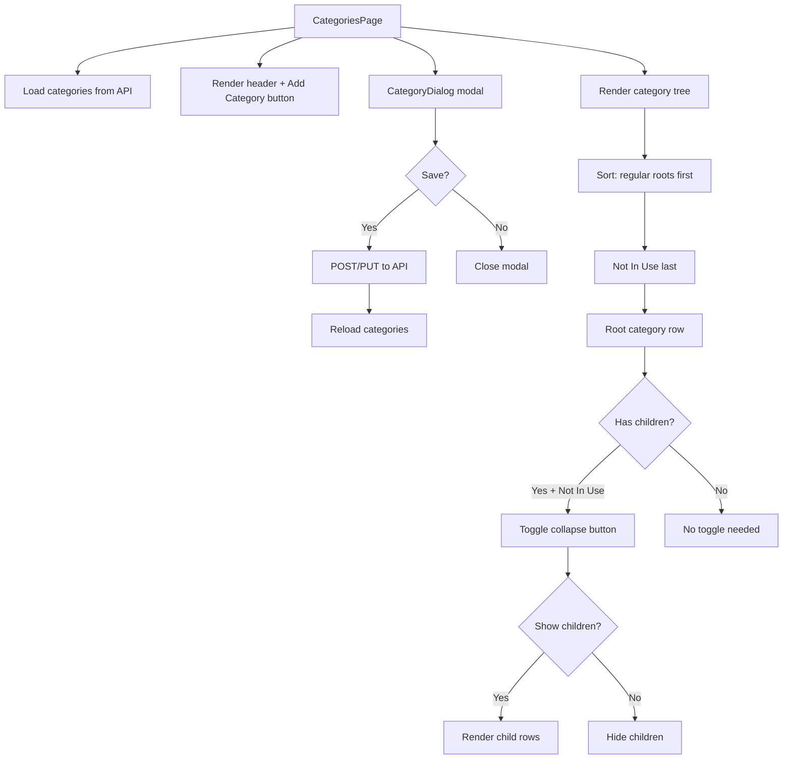

# Finance Categories Page — Enhancement Plan

## Overview

Three changes to the Finance Categories page:

1. **Pop-up modal editor** — Replace the current inline form with a Dialog modal
2. **Show/Hide "Not In Use" sub-items** — Add a collapse/expand toggle for children under a "Not In Use" root category
3. **Pin "Not In Use" to the bottom** — Always sort the "Not In Use" category last

---

## Files to Modify

| File | Purpose |
|------|---------|
| [`src/app/(app)/finance/categories/page.tsx`](../src/app/(app)/finance/categories/page.tsx) | Main categories page — all three changes go here |
| [`src/app/api/finance/categories/route.ts`](../src/app/api/finance/categories/route.ts) | API — update sort order to use `sortOrder` field |

---

## Change 1: Modal Editor for Categories

### Current approach
- Inline form rendered conditionally with `showForm` state
- Form appears/disappears within the page flow below the header

### New approach
- Extract the form into a controlled `CategoryDialog` component (internally within the same file or as a separate component)
- Use the existing [`Dialog`](../src/components/ui/dialog.tsx) primitives (`Dialog`, `DialogContent`, `DialogHeader`, `DialogTitle`, `DialogFooter`)
- Follow the pattern established by [`EditItemDialog`](../src/components/lists/EditItemDialog.tsx)

### Implementation steps
1. Create a `CategoryDialog` component that receives:
   - `open: boolean`
   - `onOpenChange: (open: boolean) => void`
   - `editing: Category | null`
   - `availableParents: Category[]`
   - `onSaved: () => void` (triggers refresh)

2. Move all form fields (name, type, parent, color, flags) into the dialog body

3. Replace the inline form section with `<CategoryDialog ... />`

4. Wire up the "Add Category" button and edit pencil icon to trigger `onOpenChange(true)`

```tsx
// Modal pattern
<Dialog open={open} onOpenChange={onOpenChange}>
  <DialogContent className="sm:max-w-lg">
    <DialogHeader>
      <DialogTitle>{editing ? 'Edit Category' : 'New Category'}</DialogTitle>
    </DialogHeader>
    {/* form fields */}
    <DialogFooter showCloseButton>
      <Button onClick={handleSave}>Save</Button>
    </DialogFooter>
  </DialogContent>
</Dialog>
```

---

## Change 2: Show/Hide "Not In Use" Sub-items

### Concept
- Detect a root category named `"Not In Use"` (case-insensitive)
- Add a collapse/expand toggle (chevron icon) next to its name
- Children are hidden by default when the page loads
- Toggle is per-session (no persistence needed — unless the user wants state saved)

### Implementation steps
1. Add a `collapsedCategories` state (`Set<string>`) to track collapsed root category IDs
2. In the tree rendering loop, check if a root category's name matches `"Not In Use"`
3. If collapsed, skip rendering children for that category
4. Add a chevron button that toggles the collapsed state

```tsx
// In the parent
const [collapsedCategories, setCollapsedCategories] = useState<Set<string>>(new Set())

function toggleCollapse(id: string) {
  setCollapsedCategories(prev => {
    const next = new Set(prev)
    if (next.has(id)) next.delete(id)
    else next.add(id)
    return next
  })
}

// In CategoryRow, when cat.name === 'Not In Use', show toggle
{hasChildren && (
  <button onClick={() => toggleCollapse(cat.id)}>
    <ChevronDown className={cn('h-4 w-4 transition-transform', collapsed && '-rotate-90')} />
  </button>
)}
```

---

## Change 3: Pin "Not In Use" to Bottom

### Concept
- "Not In Use" should always appear as the last root category
- Use the existing `sortOrder` field in the database for persistent ordering
- Client-side: detect "Not In Use" and sort it to the end of the array before rendering

### Implementation steps
1. **Client-side sorting** — Split root categories into two groups: normal and "Not In Use"
2. Render normal categories first, then "Not In Use" at the end
3. Optionally update the API to use `sortOrder` for server-side ordering consistency

```tsx
const notInUseCategory = rootCategories.find(
  c => c.name.toLowerCase() === 'not in use'
)
const regularRoots = rootCategories.filter(
  c => c.name.toLowerCase() !== 'not in use'
)
const orderedRoots = [...regularRoots, ...(notInUseCategory ? [notInUseCategory] : [])]
```

### API enhancement (optional but recommended)
- Update [`src/app/api/finance/categories/route.ts`](../src/app/api/finance/categories/route.ts) GET handler to order by `sortOrder` first, then `name`:
  ```ts
  orderBy: [{ sortOrder: 'asc' }, { name: 'asc' }],
  ```

---

## Mermaid: Component Flow



---

## Summary of Changes

| # | Change | Scope | Complexity |
|---|--------|-------|------------|
| 1 | Modal editor | Client-side only, single file | Medium |
| 2 | Show/hide toggle | Client-side only, single file | Low |
| 3 | Pin to bottom | Client-side + minor API tweak | Low |

