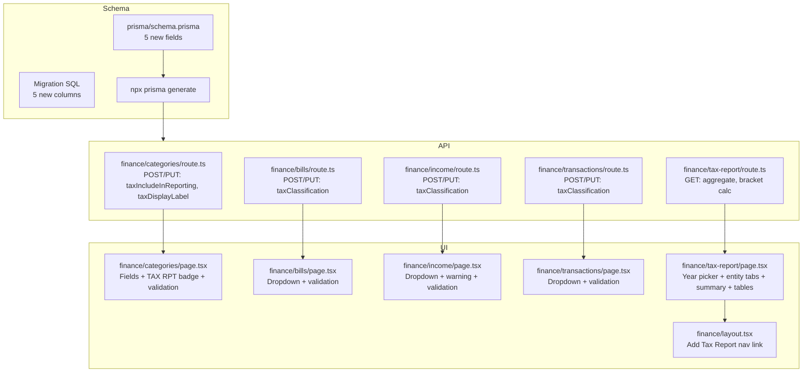

# Tax Reporting Feature — Implementation Plan

## Overview

Implement tax classification tracking across the HomeBase finance module per [`HOMEBASE_TAX_REPORTING_SPEC.md`](../docs/HOMEBASE_TAX_REPORTING_SPEC.md). This adds five new fields to the Prisma schema, updates all four finance CRUD APIs and modals, introduces modal validation with red field highlights, and creates a new Tax Report page with per-person and per-entity aggregation views.

Reference guides: [`.roo/prompts/all_modes.md`](../.roo/prompts/all_modes.md), [`.roo/prompts/global.md`](../.roo/prompts/global.md), [`.roo/prompts/modes/code.md`](../.roo/prompts/modes/code.md) — Per-Phase Approval Model, batch edits, investigation-first.

---

## Phase 1: Schema & Migration

### Files to Create
- [`prisma/migrations/20260517000000_add_tax_classification/migration.sql`](../prisma/migrations/20260517000000_add_tax_classification/migration.sql)

### Files to Modify
- [`prisma/schema.prisma`](../prisma/schema.prisma) — 5 new fields across 4 models

### Changes

#### Migration SQL — `20260517000000_add_tax_classification/migration.sql`
```sql
ALTER TABLE "FinanceCategory" ADD COLUMN "taxIncludeInReporting" BOOLEAN NOT NULL DEFAULT false;
ALTER TABLE "FinanceCategory" ADD COLUMN "taxDisplayLabel" TEXT;
ALTER TABLE "FinanceTransaction" ADD COLUMN "taxClassification" TEXT;
ALTER TABLE "FinanceRecurringBill" ADD COLUMN "taxClassification" TEXT;
ALTER TABLE "FinanceIncomeEntry" ADD COLUMN "taxClassification" TEXT;
```

#### `schema.prisma` changes

| Model | Field | Type | Default | Notes |
|-------|-------|------|---------|-------|
| `FinanceCategory` (after `isTaxDeduction`) | `taxIncludeInReporting` | `Boolean` | `false` | Whether this category's amounts appear in tax reports |
| `FinanceCategory` (after `taxIncludeInReporting`) | `taxDisplayLabel` | `String?` | — | Override label shown on tax report (e.g. "Rental Property Expenses") |
| `FinanceTransaction` (after `entityId`/`entity`) | `taxClassification` | `String?` | — | Enum-like: `null` / `"personal"` / `"business"` / `"investment"` / `"super"` |
| `FinanceRecurringBill` (after `entityId`/`entity`) | `taxClassification` | `String?` | — | Same enum |
| `FinanceIncomeEntry` (after `taxRate`) | `taxClassification` | `String?` | — | Same enum |

---

## Phase 2: API Changes

### Files to Modify

#### 1. [`src/app/api/finance/categories/route.ts`](../src/app/api/finance/categories/route.ts)
- **POST** (~line 23): Add `taxIncludeInReporting` (boolean) and `taxDisplayLabel` (string | null) to destructuring and `create` data
- **PUT** (~line 69): Same fields in destructuring and `update` data

#### 2. [`src/app/api/finance/bills/route.ts`](../src/app/api/finance/bills/route.ts)
- **POST** (~line 28): Add `taxClassification` to destructuring and `create` data
- **PUT** (~line 79): Add `taxClassification` to destructuring and `update` data (conditional spread)

#### 3. [`src/app/api/finance/income/route.ts`](../src/app/api/finance/income/route.ts)
- **POST** (~line 28): Add `taxClassification` to destructuring and `create` data
- **PUT** (~line 82): Add `taxClassification` to destructuring and `update` data (conditional spread)

#### 4. [`src/app/api/finance/transactions/route.ts`](../src/app/api/finance/transactions/route.ts)
- **POST** (~line 51): Add `taxClassification` to destructuring and `create` data
- **PUT** (~line 107): Add `taxClassification` to destructuring and `update` data

### File to Create

#### 5. [`src/app/api/finance/tax-report/route.ts`](../src/app/api/finance/tax-report/route.ts)
- **GET** handler with query params: `entityId` (optional), `memberId` (optional), `year` (default: current year)
- Aggregates from `FinanceTransaction`, `FinanceRecurringBill`, `FinanceIncomeEntry`
- Logic:
  - Filter by `familyId` (from `requireSession()`)
  - Filter by `entityId` and/or `memberId` if provided
  - Filter by `date` / `nextDueDate` / `nextExpectedDate` within tax year (July 1 – June 30)
  - Only include items where `taxClassification IS NOT NULL`
  - For categories: only include categories where `taxIncludeInReporting = true`
  - Group by `taxClassification` + category, compute totals
  - Return structure: `{ income: { personal: { total, categories: [...] }, business: {...} }, expenses: { ... }, summaries: { grossIncome, totalDeductions, taxableIncome, estimatedTax, medicareLevy, netTaxObligation } }`
- Australian tax brackets 2025-26 for estimated tax calculation:
  - $0–$18,200: 0%
  - $18,201–$45,000: 16%
  - $45,001–$135,000: $4,288 + 30%
  - $135,001–$190,000: $31,288 + 37%
  - $190,001+: $51,638 + 45%
  - Plus 2% Medicare Levy

---

## Phase 3: UI Modal Changes + Validation

### Pattern for Validation (applied to all 4 modals)

Add to each page file:
```typescript
const [errors, setErrors] = useState<Record<string, string>>({});

function validate(): boolean {
  const newErrors: Record<string, string> = {};
  if (!form.name?.trim()) newErrors.name = 'Name is required';
  if (!form.amount || Number(form.amount) <= 0) newErrors.amount = 'Amount must be greater than 0';
  // ... per-modal required fields
  setErrors(newErrors);
  return Object.keys(newErrors).length === 0;
}
```

Visual treatment for invalid fields:
```tsx
<div className={errors.fieldName ? 'border-red-500 rounded-md' : ''}>
  <select/input className={cn('...', errors.fieldName && 'border-red-500 focus-visible:ring-red-500')} />
  {errors.fieldName && <p className="text-xs text-red-500 mt-0.5">{errors.fieldName}</p>}
</div>
```

Required fields per modal:
- **Categories**: name, type
- **Bills**: name, amount, frequency, categoryId (if not personal flag), entityId (if has entities)
- **Income**: name, amount, frequency, categoryId, entityId (if has entities)
- **Transactions**: type, amount, date, accountId, categoryId

### Files to Modify

#### 1. [`src/app/(app)/finance/categories/page.tsx`](../src/app/(app)/finance/categories/page.tsx)
- Add `taxIncludeInReporting` and `taxDisplayLabel` to `Category` interface
- Add form fields in `CategoryDialog`:
  - `taxIncludeInReporting` checkbox (inside the flags section, after `isTaxDeduction`)
  - `taxDisplayLabel` text input (shown only when `taxIncludeInReporting` is checked)
- Update `useEffect` for open/edit to populate new fields
- Update `handleSave` to include new fields in payload
- Add validation errors state + validate function
- Add error highlights to required fields
- Update `CategoryRow` to show `TAX RPT` badge when `taxIncludeInReporting` is true

#### 2. [`src/app/(app)/finance/bills/page.tsx`](../src/app/(app)/finance/bills/page.tsx)
- Add `taxClassification` to `Bill` interface
- Add `taxClassification: ''` to `emptyForm`
- Update `openEdit` to populate `taxClassification`
- Update `getFormPayload` to include `taxClassification`
- Add Tax Classification dropdown in form JSX (after Entity field):
  ```tsx
  <div>
    <label className="text-sm font-medium">Tax Classification</label>
    <select value={form.taxClassification} onChange={e => setForm(p => ({ ...p, taxClassification: e.target.value }))}>
      <option value="">Not classified</option>
      <option value="personal">Personal</option>
      <option value="business">Business</option>
      <option value="investment">Investment</option>
      <option value="super">Super Fund</option>
    </select>
  </div>
  ```
- Add validation errors state + validate function
- Add error highlights to required fields

#### 3. [`src/app/(app)/finance/income/page.tsx`](../src/app/(app)/finance/income/page.tsx)
- Add `taxClassification` to `IncomeEntry` interface
- Add `taxClassification: ''` to form state
- Update `openEdit` to populate `taxClassification`
- Update `getFormPayload` to include `taxClassification`
- Add Tax Classification dropdown in Tax Tracking section (when `isTaxTracked` is true)
- Add amber warning when `isTaxTracked && !memberId` (income tracked for tax but not assigned to a person)
- Add validation errors state + validate function
- Add error highlights to required fields

#### 4. [`src/app/(app)/finance/transactions/page.tsx`](../src/app/(app)/finance/transactions/page.tsx)
- Add `taxClassification` to `Transaction` interface
- Add `taxClassification: ''` to form state
- Add Tax Classification dropdown in form JSX (after Entity field)
- Add validation errors state + validate function
- Add error highlights to required fields

---

## Phase 4: New Tax Report Page

### File to Create
- [`src/app/(app)/finance/tax-report/page.tsx`](../src/app/(app)/finance/tax-report/page.tsx)

### Page Structure
```
FinanceTaxReportPage (client component)
├── Year selector (prev year / current year / next year)
├── Entity tabs (All, [each FinanceEntity]) — horizontal chip-style tabs
├── Summary cards row
│   ├── Gross Income
│   ├── Total Deductions
│   ├── Taxable Income
│   ├── Estimated Tax
│   ├── Medicare Levy
│   └── Net Tax Obligation
├── Income breakdown table
│   └── Grouped by taxClassification → category rows
└── Expense breakdown table
    └── Grouped by taxClassification → category rows
```

### Key logic
- Fetch from `/api/finance/tax-report?entityId=X&memberId=Y&year=Z`
- Entities fetched from `/api/finance/entities` or passed as prop
- Super contributions cap indicator (annual cap ~$30k) — cumulative against income classified as `super`

---

## Phase 5: Navigation & Final Touches

### Files to Modify

#### 1. [`src/app/(app)/finance/layout.tsx`](../src/app/(app)/finance/layout.tsx)
- Add `{ href: '/finance/tax-report', label: 'Tax Report', exact: false }` to tabs array

#### 2. Docker entrypoint — Verify [`docker/entrypoint.sh`](../docker/entrypoint.sh) already has `npx prisma migrate deploy`
- Already confirmed present at lines 106-125 — no changes needed

---

## Implementation Order

| Step | Phase | Description | Approval Needed |
|------|-------|-------------|----------------|
| 1 | Phase 1 | Create migration SQL file | Per-phase |
| 2 | Phase 1 | Update `schema.prisma` with new fields + run `npx prisma generate` | Per-phase |
| 3 | Phase 2 | Update categories API route | Per-phase |
| 4 | Phase 2 | Update bills API route | Per-phase |
| 5 | Phase 2 | Update income API route | Per-phase |
| 6 | Phase 2 | Update transactions API route | Per-phase |
| 7 | Phase 2 | Create new tax-report API route | Per-phase |
| 8 | Phase 3 | Update Categories UI (fields + validation + badge) | Per-phase |
| 9 | Phase 3 | Update Bills UI (taxClassification dropdown + validation) | Per-phase |
| 10 | Phase 3 | Update Income UI (taxClassification dropdown + warning + validation) | Per-phase |
| 11 | Phase 3 | Update Transactions UI (taxClassification dropdown + validation) | Per-phase |
| 12 | Phase 4 | Create Tax Report page | Per-phase |
| 13 | Phase 5 | Add nav link in finance layout | Per-phase |
| 14 | Phase 5 | Verify Docker entrypoint | Per-phase |

---

## Architecture Diagram



---

## Risks & Considerations

1. **SQLite limitations**: No enum type. `taxClassification` stored as `TEXT` with app-level validation. Migration uses `ALTER TABLE ADD COLUMN` which is supported by SQLite.
2. **Existing data**: All new columns are nullable or have defaults, so existing rows are unaffected.
3. **Prisma schema ordering**: Fields must be added in specific positions (after related existing fields) for readability — this is a comment-only concern since Prisma field order in schema doesn't affect DB column order.
4. **`npx prisma generate`**: Must be run after schema changes to update the Prisma client types.
5. **Build verification**: After all changes, run `npm run build` to catch type errors across all files.
